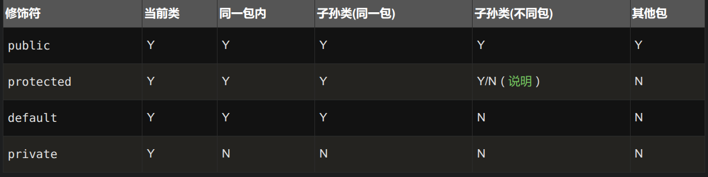
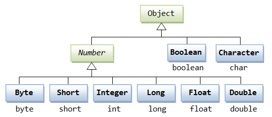
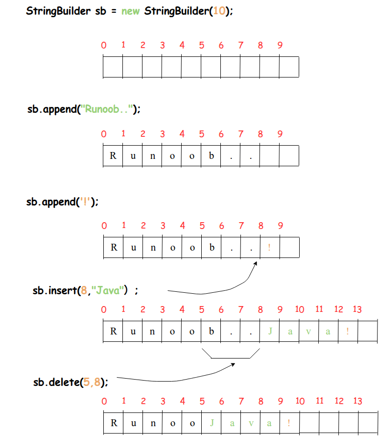

# JAVA

## 程序入口

程序在main函数进入
## throws 
throws用于声明一个方法可能会抛出的异常类型
```java
public void myMethod() throws IOException, SQLException {
    // 方法体
}
```
其中 IOException和SQLException是可能抛出的异常类型，可以有多个异常类型，用逗号分隔。
## scanf
```java
import java.util.Scanner;
public class Main {
    public static void main(String[] args) {
        Scanner scanner = new Scanner(System.in);
        System.out.print("Enter your name: ");
        String name = scanner.nextLine();
        System.out.println("Hello, " + name);
        scanner.close();
    }
}
```

## 转义字符
| 转义字符 | 说明               |
| :------- | :----------------- |
| `\ddd`   | 八进制表示的字符   |
| `\uxxxx` | 十六进制表示的字符 |
| `\'`     | 单引号             |
| `\"`     | 双引号             |
| `\\`     | 反斜杠             |
| `\n`     | 换行               |
| `\r`     | 回车               |
| `\t`     | 制表符             |
| `\b`     | 退格               |
| `\f`     | 换页               |
| `\0`     | 空字符（null字符） |
| `\a`     | 响铃（警告）       |
| `\v`     | 垂直制表符         |
## 布尔类型

布尔类型只有两个值 true 和 false，不能用 0 和 1 来表示
```java
boolean flag = true;
if (flag) {
    System.out.println("Flag is true");
} else {
    System.out.println("Flag is false");
}
```

## 数据类型的强制转换
当把一个较大的数据类型赋值给一个较小的数据类型时，必须进行强制类型转换。
当把一个较小的数据类型赋值给一个较大的数据类型时，自动进行类型转换。

```java
public class TypeCasting {
    public static void main(String[] args) {
        // 自动类型转换 (隐式转换)
        int intValue = 100;
        long longValue = intValue; // int 自动转换为 long
        System.out.println("自动类型转换: int -> long: " + longValue);
        double doubleValue = longValue; // long 自动转换为 double
        System.out.println("自动类型转换: long -> double: " + doubleValue);
        // 强制类型转换 (显式转换)
        double pi = 3.14159;
        int intPi = (int) pi; // double 强制转换为 int
        System.out.println("强制类型转换: double -> int: " + intPi); // 输出 3，小数点后被截断
        long bigLong = 1234567890123L;
        int intFromLong = (int) bigLong; // long 强制转换为 int
        System.out.println("强制类型转换: long -> int: " + intFromLong); // 输出为负数，数据溢出
    }
}
```

## 复合数据类型
### String/StringBuffer
* char占用2个字节，Java使用Unicode编码，一个char可以表示一个Unicode字符
* 字符串在Java中是一个对象，使用双引号括起来的一系列字符。无法向后添加内容，StringBuffer可以向后添加内容
```java
//String
String greeting = "Hello, World!";
String name = "Alice";
String message = greeting + " My name is " + name + ".";
String test1 = "Hello" + 7 + 8; // "Hello78"
System.out.println(greeting); // 输出: Hello, World!
System.out.println(message);  // 输出: Hello, World! My name is Alice.
System.out.println(test1);    // 输出: Hello78
```
```java
//StringBuffer
StringBuffer sb = new StringBuffer("Hello");
sb.append(", World!"); // 添加字符串
sb.insert(5, " Java"); // 在索引5处插入字符串
sb.replace(0, 5, "Hi"); // 替换索引0到
sb.delete(2, 7); // 删除索引2到7的字符
String result = sb.toString(); // 转换为字符串
System.out.println(result); // 输出: Hi, World!
```

#### 字符串加法
1. 如果字符串在前，数字在后，数字会被当作字符串处理
2. 如果数字在前，字符串在后，数字会被当作数字处理
3. 如果数字在中间，先进行数字的加法运算，再进行字符串的连接
```java
String test2 = 7 + 8 + "Hello"; // "15Hello"
System.out.println(test2); // 输出: 15Hello
String test3 = "Hello" + (7 + 8); // "Hello15"
System.out.println(test3); // 输出: Hello15
String test4 = 7 + "Hello" + 8; // "7Hello8"
System.out.println(test4); // 输出: 7Hello8
```


### 数组array
```java
int[] numbers = {1, 2, 3, 4, 5};  //静态初始化，一次性赋值
System.out.println("数组元素:");
for (int i = 0; i < numbers.length; i++) {
    System.out.println(numbers[i]);
}
```
数组声明的时候，使用new关键字进行初始化
```java
int[] array = new int[5]; // 动态初始化，内容可后续赋值
array[0] = 10; // 给数组的第一个元素赋值
array[1] = 20; // 给数组的第二个元素赋值
System.out.println("数组第一个元素: " + array[0]);
System.out.println("数组第二个元素: " + array[1]);
```
#### for-each循环
```java
int[] numbers = {1, 2, 3, 4, 5};
for (int num : numbers) {
    System.out.println(num);
}
```


### 类class
```java
public class Dog {
    String name;
    int age;

    public Dog(String name, int age) {
        this.name = name;
        this.age = age;
    }

    public void bark() {
        System.out.println(name + " says: Woof!");
    }
}
```
### 接口interface
```java
public interface Animal {
    void makeSound();
}
public class Cat implements Animal {
    public void makeSound() {
        System.out.println("Meow");
    }
}
```


## 输出/输入

```java
import java.util.Scanner;

public class IO {

    // Input and Output operations

    public static void main(String[] args) {

        System.out.println("Input and Output in Java");

        Scanner scanner = new Scanner(System.in);

        System.out.print("Enter your name: ");

        String name = scanner.nextLine();

        System.out.println("Hello, " + name);

        scanner.close();

    }

}


```

## 对象的实例化

对象的实例化需要构造器

```java
public class Puppy{
    public Puppy(){           // 无参构造器
    }
 
    public Puppy(String name){ // 带参构造器
    }
}
```

上述的三个Puppy分别为 “类” “构造器的第一个重载” “构造器的第二个重载”

构造器是必须的，而且命名和类的名字相同


## 对象运算符 instanceof

不但检测实例是否属于某个类，还会检测此类是否是指定类的子类
```java
public class InstanceofDemo {
    public static void main(String[] args) {
        Dog dog = new Dog("Buddy", 3);
        Cat cat = new Cat("Whiskers", 2);
        //假设Dog和Cat都继承自Animal类
        System.out.println("dog instanceof Dog: " + (dog instanceof Dog)); // true
        System.out.println("dog instanceof Animal: " + (dog instanceof Animal)); // true
        System.out.println("cat instanceof Cat: " + (cat instanceof Cat)); // true
        System.out.println("cat instanceof Animal: " + (cat instanceof Animal)); // true
        System.out.println("dog instanceof Cat: " + (dog instanceof Cat)); // false
    }
}
```


## toString方法

每个类在初始化的时候都从Object类进行继承，其中Object类包含了toString方法，其默认行为如下

```java
// Object类中的默认toString()实现
public String toString() {
    return getClass().getName() + "@" + Integer.toHexString(hashCode());
}
//输出内容：类的完整名称 + @ + 对象的哈希码(16进制)
```

### 在程序当中对toString进行重写

```java
// 重写了toString的员工类
class EmployeeWithToString {
    private String name;
    private int age;
    
    public EmployeeWithToString(String name) { this.name = name; }
    public void setAge(int age) { this.age = age; }
    
    @Override
    public String toString() {
        return "员工姓名: " + name + ", 年龄: " + age;
        //这样输出的内容就为 ： "员工姓名: " + name + ", 年龄: " + age
    }
}
```

## 各种类型的变量
### 值的初始化
#### 在class声明
类变量和实例变量如果没有被显式初始化，会被赋予默认值
- 数值类型（byte, short, int, long, float, double）默认值
- 为0
- char类型默认值
- 为'\u0000'（空字符）
- boolean类型默认值
- 为false
- 引用类型（如String, 数组, 对象等）默认值
- 为null
#### 在方法/构造函数/块中声明
局部变量在使用前必须显式初始化，否则编译器会报错。
### **局部变量（Local Variables）：**

局部变量是在方法、构造函数或块内部声明的变量，它们在声明的方法、构造函数或块执行结束后被销毁，局部变量在声明时需要初始化，否则会导致编译错误。

```java
public void exampleMethod() {
    int localVar = 10; // 局部变量
    // ...
}
```

### **实例变量（Instance Variables）：**

实例变量是在类中声明，但在方法、构造函数或块之外，它们属于类的实例，每个类的实例都有自己的副本，如果不明确初始化，实例变量会被赋予默认值（数值类型为0，boolean类型为false，对象引用类型为null）。

```java
public class ExampleClass {
    int instanceVar; // 实例变量
}
```

### **静态变量或类变量（Class Variables）：**

类变量是在类中用 static 关键字声明的变量，它们属于类而不是实例，所有该类的实例共享同一个类变量的值，类变量在类加载时被初始化，而且只初始化一次。

```java
public class ExampleClass {
    static int classVar; // 类变量
}
```

### **参数变量（Parameters）：**

参数是方法或构造函数声明中的变量，用于接收调用该方法或构造函数时传递的值，参数变量的作用域只限于方法内部。

```java
public void exampleMethod(int parameterVar) {
    // 参数变量
    // ...
}
```

## 值传递/引用传递

```java
public class PassByValueVsReference {
    
    public static void main(String[] args) {
        System.out.println("=== Java中的值传递 vs 引用传递演示 ===");
        
        // 1. 基本数据类型 - 值传递
        demonstrateValuePassing();
        
        System.out.println("\n" + "=".repeat(50));
        
        // 2. 对象类型 - 引用传递
        demonstrateReferencePassing();
        
        System.out.println("\n" + "=".repeat(50));
        
        // 3. 字符串的特殊情况
        demonstrateStringPassing();
        
        System.out.println("\n" + "=".repeat(50));
        
        // 4. 数组传递
        demonstrateArrayPassing();
    }
    
    // 1. 基本数据类型的值传递演示
    public static void demonstrateValuePassing() {
        System.out.println("=== 基本数据类型 - 值传递 ===");
        
        int originalInt = 100;
        double originalDouble = 19.99;
        boolean originalBoolean = true;
        char originalChar = 'A';
        
        System.out.println("调用方法前:");
        System.out.printf("int: %d, double: %.2f, boolean: %b, char: %c%n", 
                         originalInt, originalDouble, originalBoolean, originalChar);
        
        // 调用修改方法
        modifyPrimitives(originalInt, originalDouble, originalBoolean, originalChar);
        
        System.out.println("调用方法后:");
        System.out.printf("int: %d, double: %.2f, boolean: %b, char: %c%n", 
                         originalInt, originalDouble, originalBoolean, originalChar);
        System.out.println("结论: 基本数据类型传递的是值的副本，原变量不会被修改");
    }
    
    public static void modifyPrimitives(int i, double d, boolean b, char c) {
        System.out.println("在方法内修改参数...");
        i = 999;
        d = 88.88;
        b = false;
        c = 'Z';
        System.out.printf("方法内修改后: int: %d, double: %.2f, boolean: %b, char: %c%n", 
                         i, d, b, c);
    }
    
    // 2. 对象类型的引用传递演示
    public static void demonstrateReferencePassing() {
        System.out.println("=== 对象类型 - 引用传递 ===");
        
        Person person = new Person("张三", 25);
        
        System.out.println("调用方法前:");
        System.out.println(person);
        
        // 调用修改方法
        modifyObject(person);
        
        System.out.println("调用方法后:");
        System.out.println(person);
        System.out.println("结论: 对象传递的是引用，方法内的修改会影响原对象");
    }
    
    public static void modifyObject(Person p) {
        System.out.println("在方法内修改对象属性...");
        p.setName("李四");
        p.setAge(30);
        System.out.println("方法内修改后: " + p);
    }
    
    // 3. 字符串的特殊情况演示
    public static void demonstrateStringPassing() {
        System.out.println("=== 字符串的特殊情况 ===");
        
        String originalString = "Hello";
        
        System.out.println("调用方法前: " + originalString);
        
        // 尝试修改字符串
        modifyString(originalString);
        
        System.out.println("调用方法后: " + originalString);
        System.out.println("结论: 字符串虽然是对象，但由于不可变性，表现类似值传递");
    }
    
    public static void modifyString(String s) {
        System.out.println("在方法内尝试修改字符串...");
        s = "World";
        System.out.println("方法内修改后: " + s);
    }
    
    // 4. 数组传递演示
    public static void demonstrateArrayPassing() {
        System.out.println("=== 数组传递演示 ===");
        
        int[] numbers = {1, 2, 3, 4, 5};
        
        System.out.println("调用方法前:");
        printArray(numbers);
        
        // 修改数组
        modifyArray(numbers);
        
        System.out.println("调用方法后:");
        printArray(numbers);
        System.out.println("结论: 数组是对象，传递引用，方法内修改会影响原数组");
    }
    
    public static void modifyArray(int[] arr) {
        System.out.println("在方法内修改数组...");
        for (int i = 0; i < arr.length; i++) {
            arr[i] = arr[i] * 10;
        }
        System.out.println("方法内修改后:");
        printArray(arr);
    }
    
    public static void printArray(int[] arr) {
        System.out.print("数组内容: [");
        for (int i = 0; i < arr.length; i++) {
            System.out.print(arr[i]);
            if (i < arr.length - 1) System.out.print(", ");
        }
        System.out.println("]");
    }
}

// 辅助类：Person
class Person {
    private String name;
    private int age;
    
    public Person(String name, int age) {
        this.name = name;
        this.age = age;
    }
    
    // Getter和Setter方法
    public String getName() { return name; }
    public void setName(String name) { this.name = name; }
    public int getAge() { return age; }
    public void setAge(int age) { this.age = age; }
    
    @Override
    public String toString() {
        return String.format("Person{name='%s', age=%d}", name, age);
    }
}
```

java的引用并非是直接通过指针进行传递的，Java通过**对象引用**提供了指针的核心功能（间接访问对象），但**去除了指针的危险性**，这是Java"安全性优先"设计理念的体现！

## final关键字

**`final` 关键字的三种用法：**

1. **`final` 变量 - 常量**

2. **`final` 方法 - 不可重写的方法**

3. **`final` 类 - 不可继承的类**

## 访问权限和方法 

```java
public class Counter {
    private static int count = 0;
    
    public Counter() {
        count++;
    }
    
    public static int getCount() {
        return count;
    }
    
    public static void main(String[] args) {
        Counter c1 = new Counter();
        Counter c2 = new Counter();
        Counter c3 = new Counter();
        System.out.println("目前为止创建的对象数: " + Counter.count); // way1
        System.out.println("目前为止创建的对象数: " + Counter.getCount()); // way2
    }
}
```

在这种情况下两者效果是一致的，但是注意到private变量只能在自己class的方法当中使用，所以在如下的情况下，第一种方法是不妥当的

```java
public class CounterComparison {
    private static int count = 0;        // private - 外部无法直接访问
    
    public CounterComparison() {
        count++;
    }
    
    public static int getCount() {       // public方法 - 外部可以访问
        return count;
    }
    
    public static void main(String[] args) {
        CounterComparison c1 = new CounterComparison();
        CounterComparison c2 = new CounterComparison();
        CounterComparison c3 = new CounterComparison();
        
        // 在同一个类内部 - 两种方式都可以
        System.out.println("直接访问: " + CounterComparison.count);
        System.out.println("方法访问: " + CounterComparison.getCount());
    }
}

// 在其他类中使用
class OtherClass {
    public static void main(String[] args) {
        CounterComparison c1 = new CounterComparison();
        CounterComparison c2 = new CounterComparison();
        
        // ❌ 编译错误！无法访问private变量
        // System.out.println(CounterComparison.count);
        
        // ✅ 正确！可以调用public方法
        System.out.println("通过方法访问: " + CounterComparison.getCount());
    }
}
```

## 访问控制修饰符

Java中，可以使用访问控制符来保护对类、变量、方法和构造方法的访问。Java 支持 4 种不同的访问权限。

- **default** (即默认，什么也不写）: 在同一包内可见，不使用任何修饰符。使用对象：类、接口、变量、方法。
- **private** : 在同一类内可见。使用对象：变量、方法。 **注意：不能修饰类（外部类）**
- **public** : 对所有类可见。使用对象：类、接口、变量、方法
- **protected** : 对同一包内的类和所有子类可见。使用对象：变量、方法。 **注意：不能修饰类（外部类）**。


其实最常用的只有public和private，如果在类、变量、方法或构造函数的定义中没有指定任何访问修饰符，那么它们就默认具有默认访问修饰符，即default

至于protected，理解比较难，后续填坑

## protected修饰符

//pass

## 带有static修饰的方法

static 关键字用来声明独立于对象的**静态方法**。静态方法不能使用类的非静态变量。静态方法从参数列表得到数据，然后计算这些数据。

当方法前存在static关键字的时候，只能访问静态变量，而当没有static的时候，可以访问静态变量和实例变量（不带static修饰）

```java
public class StaticVsInstanceDemo {
    private static int staticCount = 0;      // 静态变量
    private int instanceCount = 0;           // 实例变量
    
    public StaticVsInstanceDemo() {
        staticCount++;
        instanceCount++;
    }
    
    // static方法 - 属于类
    public static int getStaticCount() {
        return staticCount;
    }
    
    // 非static方法 - 属于对象实例
    public int getInstanceCount() {
        return instanceCount;
    }
    
    // static方法不能访问非static成员
    public static void staticMethod() {
        System.out.println("静态方法被调用");
        System.out.println("可以访问静态变量: " + staticCount);
        
        // ❌ 以下操作会编译错误
        // System.out.println("无法访问实例变量: " + instanceCount);  // 错误！
        // getInstanceCount();  // 错误！无法调用实例方法
    }
    
    // 非static方法可以访问所有成员
    public void instanceMethod() {
        System.out.println("实例方法被调用");
        System.out.println("可以访问静态变量: " + staticCount);
        System.out.println("可以访问实例变量: " + instanceCount);
        getStaticCount();    // ✅ 可以调用静态方法
    }
    
    public static void main(String[] args) {
        System.out.println("=== static vs 非static 方法演示 ===");
        
        // 1. static方法的调用方式
        System.out.println("\n--- static方法调用 ---");
        
        // 方式1：通过类名调用（推荐）
        System.out.println("通过类名调用: " + StaticVsInstanceDemo.getStaticCount());
        StaticVsInstanceDemo.staticMethod();
        
        // 方式2：不需要创建对象就能调用
        System.out.println("不创建对象就能调用: " + getStaticCount());
        
        // 2. 非static方法的调用方式
        System.out.println("\n--- 非static方法调用 ---");
        
        // 必须先创建对象
        StaticVsInstanceDemo obj1 = new StaticVsInstanceDemo();
        StaticVsInstanceDemo obj2 = new StaticVsInstanceDemo();
        
        System.out.println("obj1的实例计数: " + obj1.getInstanceCount());
        System.out.println("obj2的实例计数: " + obj2.getInstanceCount());
        System.out.println("静态计数: " + getStaticCount());
        
        obj1.instanceMethod();
        
        // ❌ 错误：无法通过类名调用实例方法
        // StaticVsInstanceDemo.getInstanceCount();  // 编译错误
    }
}
```
## 流程控制语句

### if语句
```java
if (condition) {
    // 条件为真时执行的代码
} else if (anotherCondition) {
    // 另一个条件为真时执行的代码
} else {
    // 所有条件都为假时执行的代码
}
```

### switch语句
```java
switch (expression) {
    case value1:
        // 当expression等于value1时执行的代码
        break; // 可选的，用于跳出switch语句
    case value2:
        // 当expression等于value2时执行的代码
        break; // 可选的
    // 可以有任意数量的case语句
    default:
        // 当expression不匹配任何case时执行的代码
        break; // 可选的
}
```


### while循环
```java
while (condition) {
    // 条件为真时重复执行的代码
}
```

### do-while循环
```java
do {
    // 先执行一次，然后在条件为真时重复执行的代码
} while (condition);
```

### for循环
```java
for (initialization; condition; update) {
    // 循环体代码
}
```

### 增强型for循环（for-each循环）
```java
for (type element : collection) {
    // 遍历集合或数组的每个元素，element表示当前元素，type是元素的类型，collection是要遍历的集合或数组
}
```

### break标签
```java
outerLoop: // 标签名
for (int i = 0; i < 5; i++) {
    for (int j = 0; j < 5; j++) {
        if (i * j > 6) {
            break outerLoop; // 跳出外层循环
        }
        System.out.println("i: " + i + ", j: " + j);
    }
}
```
### continue标签
```java
outerLoop: // 标签名
for (int i = 0; i < 5; i++) {
    for (int j = 0; j < 5; j++) {
        if (i * j > 6) {
            continue outerLoop; // 跳过当前外层循环的剩余部分，进入下一次外层循环
        }
        System.out.println("i: " + i + ", j: " + j);
    }
}
```

## Java 装箱与拆箱总结

### 1. 什么是装箱（Boxing）？
装箱是将**基本数据类型**（如 int、double 等）转换为**对应的包装类对象**（如 Integer、Double 等）的过程。

**举例：**
```java
int num = 10;
Integer boxedNum = Integer.valueOf(num); // 显式装箱
Integer autoBoxedNum = num; // 自动装箱（Java 5及以后）
```

### 2. 什么是拆箱（Unboxing）？
拆箱是将**包装类对象**转换为**对应的基本数据类型**的过程。

**举例：**
```java
Integer obj = 20;
int unboxedNum = obj.intValue(); // 显式拆箱
int autoUnboxedNum = obj; // 自动拆箱（Java 5及以后）
```

### 3. 为什么需要装箱与拆箱？

- **集合只能存对象，不能存基本类型。**
  例如 `ArrayList<Integer>` 只能存 `Integer` 类型，不能直接存 int。
- **包装类有更多操作方法。**
  如 `Integer` 可以调用 `.compareTo()`、`.toString()` 等方法。
- **包装类可以表示 null，基本类型不行。**
  例如 `Integer i = null;` 合法，`int j = null;` 会报错。

### 4. 总结

- **装箱：** 基本类型 → 包装类对象（int → Integer）
- **拆箱：** 包装类对象 → 基本类型（Integer → int）

> 装箱与拆箱让基本类型可以参与更多 Java 机制（如集合、泛型、方法调用等），赋予更多功能和灵活性。


## Number && Math 类

java的数字数据类型继承语于Number类，Number类提供了一些方法用于将数字转换为不同的基本数据类型。
### Number类的方法
```java

Number num = 2.33;
System.out.println("intValue: " + num.intValue());       // 转换为int,会截断小数部分
System.out.println("longValue: " + num.longValue());     // 转换为long,会截断小数部分
System.out.println("floatValue: " + num.floatValue());   // 转换为float,会保留小数部分
System.out.println("doubleValue: " + num.doubleValue()); // 转换为double,会保留小数部分
```
### 大数值处理
```java
import java.math.BigDecimal;
import java.math.BigInteger;
public class BigNumberDemo {
    public static void main(String[] args) {
        // 使用BigInteger处理大整数
        BigInteger bigInt1 = new BigInteger("123456789012345678901234567890");
        BigInteger bigInt2 = new BigInteger("987654321098765432109876543210");
        
        BigInteger bigIntSum = bigInt1.add(bigInt2);
        System.out.println("大整数相加: " + bigIntSum);
        
        // 使用BigDecimal处理高精度小数
        BigDecimal bigDec1 = new BigDecimal("0.1");
        BigDecimal bigDec2 = new BigDecimal("0.2");
        
        BigDecimal bigDecSum = bigDec1.add(bigDec2);
        System.out.println("高精度小数相加: " + bigDecSum);
        
        // 演示浮点数精度问题
        double doubleSum = 0.1 + 0.2;
        System.out.println("普通浮点数相加: " + doubleSum); // 可能输出0.30000000000000004
    }
}
```

### math类的方法
math的方法均为静态方法
```java
import java.lang.Math;
public class Test {  
    public static void main (String []args)  
    {  
        System.out.println("90 度的正弦值：" + Math.sin(Math.PI/2));  
        System.out.println("0度的余弦值：" + Math.cos(0));  
        System.out.println("60度的正切值：" + Math.tan(Math.PI/3));  
        System.out.println("1的反正切值： " + Math.atan(1));  
        System.out.println("π/2的角度值：" + Math.toDegrees(Math.PI/2));  
        System.out.println(Math.PI);  
    }  
}
```
## Character类
Character类是Java中用于处理单个字符的类，提供了多种方法来操作和检查字符的属性。Character类中的方法大多数是静态的，可以直接通过类名调用，而不需要创建Character类的实例。
（才晓得char是Character的缩写）
``` java
char ch = 'a';
 
// Unicode 字符表示形式
char uniChar = '\u039A'; 
 
// 字符数组
char[] charArray ={ 'a', 'b', 'c', 'd', 'e' };
```
### 转译符
| 转义字符 | 说明               |
| :------- | :----------------- |
| `\ddd`   | 八进制表示的字符   |
| `\uxxxx` | 十六进制表示的字符 |
| `\'`     | 单引号             |
| `\"`     | 双引号             |
| `\\`     | 反斜杠             |
| `\n`     | 换行               |
| `\r`     | 回车               |
| `\t`     | 制表符             |
| `\b`     | 退格               |
| `\f`     | 换页               |
| `\0`     | 空字符（null字符） |
| `\a`     | 响铃（警告）       |
| `\v`     | 垂直制表符         |
### Character类常用方法

| 方法名               | 说明                                                         |
| :------------------- | :----------------------------------------------------------- |
| `isDigit(char ch)`   | 检查字符是否为数字                                           |
| `isLetter(char ch)`  | 检查字符是否为字母                                           |
| `isWhitespace(char ch)` | 检查字符是否为空白字符（如空格、制表符等）               |
| `toUpperCase(char ch)` | 将字符转换为大写字母                                     |
| `toLowerCase(char ch)` | 将字符转换为小写字母                                     |
| `isUpperCase(char ch)` | 检查字符是否为大写字母                                     |
| `isLowerCase(char ch)` | 检查字符是否为小写字母                                     |
| `toString(char ch)`    | 将字符转换为字符串                                       |
| `compare(char x, char y)` | 比较两个字符的大小，返回一个整数值（负数、零或正数） |
| `getNumericValue(char ch)` | 获取字符的数值表示（如果字符是数字）               | 
## StringBuffer类

如果操作的是可变长度的字符串，建议使用StringBuffer类


