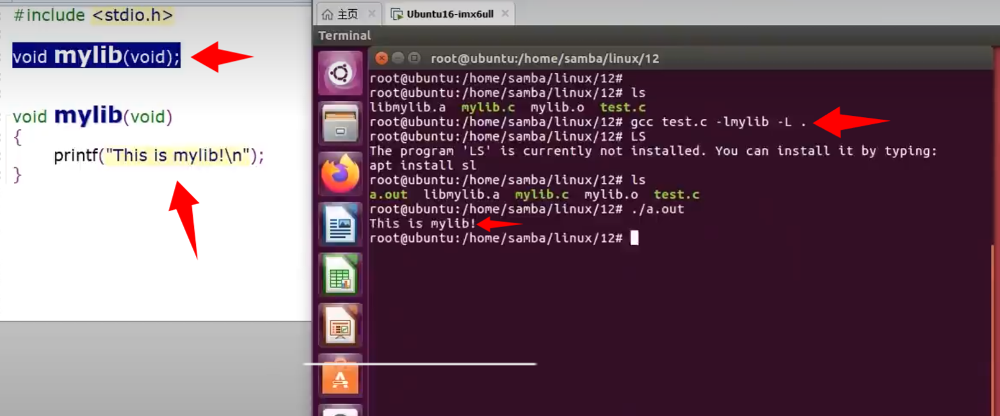
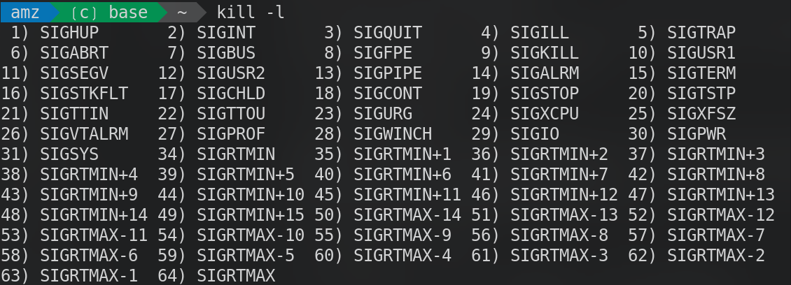
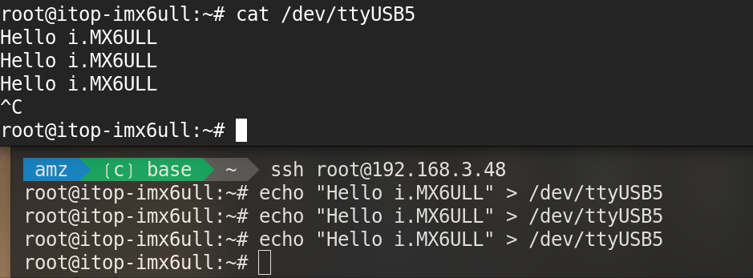
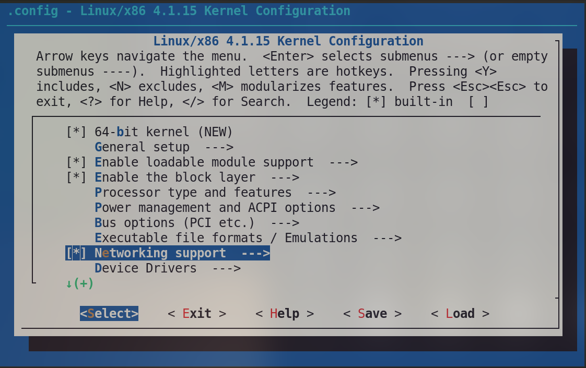

# Linux 嵌入式开发

## 权限

### 权限的查看

```bash
ls -l <filename>
```

- r：可读 (read)
- w：可写 (write)
- x：可执行 (execute)

### 更改权限chmod

- 通过符号方式更改权限：

  ```bash
  chmod u+x 文件名   # 给文件拥有者添加执行权限
  chmod g-w 文件名   # 移除所属组的写权限
  chmod o+r 文件名   # 给其他用户添加读权限
  ```
- 通过数字方式更改权限：

  ```bash
  chmod 755 文件名   # 拥有者(rwx)，组(r-x)，其他用户(r-x)
  chmod 644 文件名   # 拥有者(rw-)，组(r--)，其他用户(r--)
  ```
- r = 4
- w = 2
- x = 1

## 防火墙设置


常用命令

```bash
ufw status         # 查看防火墙状态
ufw enable         # 启用防火墙
ufw disable        # 关闭防火墙
ufw allow 端口号   # 允许某端口通过
ufw deny 端口号    # 禁止某端口通过
ufw delete allow 端口号   # 删除允许规则
ufw delete deny 端口号    # 删除禁止规则
ufw reset          # 重置所有防火墙规则
ufw logging on     # 开启日志
ufw logging off    # 关闭日志
```
## 开机脚本 && 脚本执行顺序
编辑 `/etc/rc.local` 文件即可
```bash
/home/root/time.sh &   # 后台执行
/home/root/my_start.sh  # 阻塞执行      
exit 0        
```

## 显示进程动态

```bash
ps
```
## 开关内核打印

```bash
echo 0 > /proc/sys/kernel/printk # 关闭内核打印
echo 8 > /proc/sys/kernel/printk # 恢复默认值
```
## 创建属于自己的命令

### 通过/bin/进行修改

将c语言文件传入gcc进行编译，假设获得的可执行文件为 `my_cmd`

将此文件拷贝到 `/bin/`
即可随时输入 `my_cmd`进行调用

```bash
gcc test.c -o my_cmd
cp my_cmd /bin/
my_cmd   #在任何地方可以执行
```

### 通过修改全局变量进行修改

```bash
gcc test.c -o my_cmd
export PATH=/test/my_cmd:$PATH   #临时修改
```

如果需要常驻此全局变量则需要将上面的命令追加到 `/.bashrc` 随后重新加载

```bash
vim ~/.bashrc #在文件当中追加相应的内容(export PATH=/test/my_cmd:$PATH)
source ~/.bashrc
```

## make && makefile

1. make是一种编译辅助工具。先前通过gcc编译，但是gcc很麻烦，于是使用make进行编译 。
2. make会按照设置内容检测哪些文件需要再次编译、是否编译
3. makefile描述了整个工程的编译链接的一些规则，必须命名为makefile

### makefile怎么写

如下就是一个最简单的makefile

```makefile
all:command,o    # all的依赖内容三command.o
    gcc command.o -o command
  
command,o:command.c   # 如果找不到command.o 则 使用command.c编译出command.o
	gcc -c command.c -o command.o
```

### 快速删除make生成的文件

在makefile增加clean

```makefile
clean:
	rm rf *.o command   #删除掉所有.o文件 删除掉编译出的可执行文件command
```

保存之后，bash输入

```bash
make clean 
```

即可执行clean当中所写的内容

### 伪目标

当clean的内容当中包含了不属于编译产物的文件（但是和makefile当中的同名）的时候，直接make会报错

在clean前进行伪目标的声明,通常来说clean默认都应当被手动声明为伪目标。

```makefile
.PHONY:clean
clean:
	rm -rf *.o hello
```

### 变量赋值 && 引用

makefile的变量是可以赋值的desuwa

#### 立马赋值

```makefile
var1:=aaa
var2:=$(var1)bbb
var1:=ccc
all:
	echo $(var2)   # 输出为aaabbb
```

#### 延迟赋值

延迟赋值以最后被指定的值为准

```makefile
var1=aaa
var2=$(var1)bbb
var1=ccc
all:
	echo $(var2)   #输出cccbbb
```

#### 选择性赋值

如果已经被赋值，则无效。否则赋值为右值

```makefile
var1:=aaa
var1?=bbb # 此时不会赋值

var2?=ccc # 此时被赋值为ccc
```

#### 追加赋值

```makefile
var1:=aaa
var1+=bbb   # 此时var1为  aaabbb
```

## 自动化变量

常用的自动化变量有  `$@` 、`$<`、 `$^`

- `$@` 代表规则中的目标文件
- `$<` 代表第一个依赖文件
- `$^` 代表所有的依赖文件

```makefile
var:=command.o main.o
command:$(var)
  gcc $^ -o command
  #等同于 gcc $^ -o $@
%.o:%.c
  gcc -c $< -o $@
clean:
  rm -rf *.o command
```

如上内容的含义是：
- command依赖command.o和main.o
- 通过gcc将所有依赖文件编译成command
- 任何以.o结尾的文件都可以通过对应的.c文件编译而成

## wildcard函数
功能是展开符合条件的文件列表

```makefile
SRCS:=$(wildcard *.c)  #将当前目录下所有.c文件赋值给SRCS
SRCS:=$(wildcard src/*.c)  #将src目录下所有.c文件赋值给SRCS
OBJS:=$(SRCS:.c=.o)  #将SRCS当中的.c
#替换为.o并赋值给OBJS
```
## notdir函数
功能是去掉路径，只保留文件名
```makefile
SRCS:=src/command.c src/main.c
OBJS:=$(notdir $(SRCS))  #OBJS=command.c main.c
```

## dir函数
功能是去掉文件名，只保留路径
```makefile
SRCS:=src/command.c src/main.c
DIRS:=$(dir $(SRCS))  #DIRS=src/ src/
```

## patsubst函数
功能是替换字符串
```makefile
SRCS:=src/command.c src/main.c
OBJS:=$(patsubst src/%.c,build/%.o,$(SRCS))  
# 将src/command.c 替换为 build/command.o
```
替换不会改变当前目录下的文件

## foreach函数
功能是对列表当中的每一项进行操作
```makefile
SRCS:=src/command.c src/main.c
OBJS:=$(patsubst src/%.c,build/%.o,$(SRCS))  
DIRS:=$(dir $(OBJS))  #DIRS=build/ 
ALLDIRS:=$(foreach dir,$(DIRS),$(shell mkdir -p $(dir)))
# 对DIRS当中的每一项进行mkdir -p操作
```

## 连接开发板

打开命令行输入
```bash
ls /dev/ttyUSB*
```
查看对应的设备号后，使用com软件进行连接
```bash
minicom -D /dev/ttyUSB0 -b 115200
screen /dev/ttyUSB0 115200
picocom -b 115200 /dev/ttyUSB0
```
或者使用SSH
```bash
ssh -oHostKeyAlgorithms=+ssh-rsa root@192.168.3.48
```

接下来就能进入运行在arm架构下的linux系统了

# Linux下的C语言编程

## 网络连接
### 开启和关闭无线网卡
```bash
sudo ifconfig wlan0 up   #开启无线网卡
sudo ifconfig wlan0 down #关闭无线网卡
```
### 扫描无线网络
```bash
sudo iwlist wlan0 scan  #扫描无线网络
```
### 连接无线网络
```bash
wpa_supplicant -B -i wlan0 -c /etc/wpa_supplicant.conf  #连接无线网络
```

### 开启DHCP
```bash
udhcpc -i wlan0 
```

### 开启和关闭有线网卡
```bash
sudo ifconfig eth0 up   #开启有线网卡
sudo ifconfig eth0 down #关闭有线网卡
```
### 连接有线网络
```bash
dhclient eth0   #连接有线网络
```

### 查看网络连接状态
```bash
ifconfig   #查看网络连接状态
```
## cout 和 cerr 的区别
- cout 是标准输出流，通常用于输出正常的信息。
- cerr 是标准错误流，通常用于输出错误信息。cerr 通常不进行缓冲，意味着错误信息会立即显示出来，而不会被延迟。
在使用程序输出重定向时，cout 的输出可以被重定向到文件或其他设备，而 cerr 的输出通常仍然显示在终端上，以确保错误信息不会被忽略。


## main函数的参数
```c
int main(int argc, char *argv[])
```
- argc：表示命令行参数的个数，至少为1，因为***程序名称本身也是一个参数***。
- argv：是一个***字符串数组***，包含了所有的命令行参数。argv[0]是程序名称，argv[1]是第一个参数，依此类推。


## 开关GPIO（系统级应用）
```c
#include <stdio.h>

void main(int argc, char *argv[])
{
    int cnt;
    if (argc != 2)
    {
        printf("Usage: %s <0|1>\n", argv[0]);
        return;
    }
    else
    {
        cnt = (argv[1][0]) - '0';
    }
    // 蜂鸣器开关cnt次
    while (cnt--)
    {
        char command[100];
        snprintf(command, sizeof(command), "echo 1 > /sys/class/leds/beep/brightness");
        system(command); // 设置蜂鸣器频率
        sleep(0.5);
        snprintf(command, sizeof(command), "echo 0 > /sys/class/leds/beep/brightness");
        system(command); // 设置蜂鸣器频率
        sleep(1);
    }
}
```
编译成功后执行代码内容即可。
其中echo 1 > /sys/class/leds/beep/brightness
是通过系统命令的方式控制GPIO口的高低电平（在这里被抽象成了一个文件），Linux驱动开发者使得其在写入1时输出高电平，写入0时输出低电平。


## 文件IO
文件 IO 是直接调用内核提供的系统调用函数，头文件是 unistd.h，标准 IO 是间接调用系统调用函数，头文件是 stdio.h，文件 IO 是依赖于 Linux 操作系统的，标准 IO 是不依赖操作系统的，所以在任何的操作系统下，使用标准 IO，也就是 C 库函数操作文件的方法都是相同的。

文件 IO 使用文件操作符 、标准 IO 使用流操作符。

对于文件 IO 来说，一切都是围绕文件操作符来进行的。在 Linux 系统中，所有打开的文件都有一个对
应的文件描述符。文件描述符的本质是一个非负整数，当我们打开一个文件时，系统会给我们分配一个文
件描述符。当我们对一个文件做读写操作的时候，我们使用 open 函数返回的这个文件描述符会标识该文件，
并将其作为参数传递给 read 或者 write 函数。
文件描述符从3开始 ， 0、1、2分别是标准输入、标准输出和标准错误输出。
### 描述符
* fd == 0 : 标准输入
* fd == 1 : 标准输出
* fd == 2 : 标准错误输出
剩下1024 - 3 个描述符可以被用户程序使用（不同平台默认可分配的描述符数量不同，可以通过 ulimit -n 查看和设置）
### open函数
open函数的原型如下：
```c
#include <fcntl.h>
int open(const char *pathname, int flags);
int open(const char *pathname, int flags, mode_t mode);
```
- pathname：要打开的文件路径。
- flags：打开文件的标志，可以是以下值的按位或：
- O_RDONLY：只读方式打开文件。
- O_WRONLY：只写方式打开文件。
- O_RDWR：读写方式打开文件。
- O_CREAT：如果文件不存在则创建文件。
- O_TRUNC：如果文件存在则将文件长度截断为0。
- O_APPEND：以追加方式写入文件。
- flags参数必须指定一个访问模式（O_RDONLY、O_WRONLY 或 O_RDWR）中的一个，可以与其他标志组合使用。
- mode：文件的权限，当使用 O_CREAT 标志创建文件时需要指定该参数。常用的权限值有：
- S_IRUSR：文件所有者具有读权限。
- S_IWUSR：文件所有者具有写权限。
- S_IRGRP：文件所属组具有读权限。
- S_IWGRP：文件所属组具有写权限。
- S_IROTH：其他用户具有读权限。
- S_IWOTH：其他用户具有写权限。
- 返回值：成功时返回文件描述符，失败时返回-1，并设置 errno 变量以指示错误原因。

### close函数
关闭open打开的文件，参数为open返回的文件描述符
```c
#include <unistd.h>
int close(int fd);
```
- fd：要关闭的文件描述符。
- 返回值：成功时返回0，失败时返回-1，并设置 errno 变量
- 以指示错误原因。
- 关闭文件描述符后，该文件描述符将不再有效，不能再用于读写操作。
- 关闭文件描述符是一个重要的资源管理操作，确保及时关闭不再使用的文件描述符可以避免资源泄漏。
- 在程序结束时，操作系统会自动关闭所有打开的文件描述符，但最好在不再需要文件时显式关闭它们。
- 如果一个文件描述符被多次关闭，后续的关闭操作将失败，并返回-1。
- 关闭一个文件描述符不会影响其他指向同一文件的文件描述符。
### read函数
读取文件内容，参数fd为open返回的文件描述符 buf为存储读取内容的缓冲区，count为要读取的字节数
#### ssize_t 类型
表示字节数或错误码
* 正数：表示实际读取/写入的字节数
* -1：表示操作失败（错误）
```c
#include <unistd.h>
ssize_t read(int fd, void *buf, size_t count);

```
### write函数
写入文件内容，参数fd为open返回的文件描述符 buf为存储写入内容的缓冲区，count为要写入的字节数

```c
#include <unistd.h>
ssize_t write(int fd, const void *buf, size_t count);
```
### lseek函数
移动文件指针，参数fd为open返回的文件描述符 offset为偏移量
返回值为新的文件指针位置，失败返回-1 
```c
#include <unistd.h>
off_t lseek(int fd, off_t offset, int whence);
```
whence参数指定偏移的起始位置，可以是以下值之一：
- SEEK_SET：文件开头。
- SEEK_CUR：当前位置。
- SEEK_END：文件结尾。

## 目录IO
### mkdir函数
创建目录
```c
#include <sys/stat.h>
#include <sys/types.h>
int mkdir(const char *pathname, mode_t mode);
```
- pathname：要创建的目录路径。
- mode：目录的权限，通常使用八进制表示，例如 0755。
- 返回值：成功时返回0，失败时返回-1，并设置 errno 变量
  
  ### opendir / closedir 函数
  打开和关闭目录
```c
#include <dirent.h>
#include <sys/types.h>
//输入指定路径打开目录
int main (int argc, char *argv[])
{
    DIR *dirp;
    dirp = opendir(argv[1]); // 打开目录
    if (dirp == NULL)
    {
        perror("opendir failed");
        return -1;
    }
    else 
    {
        printf("Directory opened successfully\n");
    }
    if (closedir(dirp) == -1) // 关闭目录
    {
        perror("closedir failed");
        return -1;
    }
    else 
    {
        printf("Directory closed successfully\n");
    }
    return 0;
}
```
- name：要打开的目录路径。
- dirp：要关闭的目录流指针。
- 返回值：opendir 成功时返回目录流指针，失败时返回 NULL 并设置 errno 变量；closedir 成功时返回0，失败时返回-1 并设置 errno 变量。
- 打开目录后，可以使用 readdir 函数读取目录中的条目。


### readdir函数
读取目录条目
```c
#include <dirent.h>
struct dirent *readdir(DIR *dirp);
```

- dirp：要读取的目录流指针。
- 返回值：成功时返回指向 dirent 结构的指针，失败或到达目录末尾时返回 NULL。
- 读取到的 dirent 结构包含以下字段：
  - d_ino：文件的 inode 编号,使用ls -i查看。
  - d_name：文件名字符串。
  - d_type：文件类型（例如 DT_REG 表示常规文件，DT_DIR 表示目录）。
  - d_reclen：目录项长度。
  - d_namlen：文件名长度。
  - d_off：下一个目录项的偏移量。
  - d_pad：保留字段，未使用。
  - 通过循环调用 readdir，可以遍历目录中的所有条目，直到返回 NULL 表示目录末尾。
  - 读取目录条目后，可以使用 stat 函数获取更多关于文件的信息，例如权限、大小和修改时间等。

### 示例代码
```c
#include <stdio.h>
#include <stdlib.h>
#include <dirent.h>
int main(int argc, char *argv[])
{
    DIR *dirp;
    struct dirent *entry;

    if (argc != 2)
    {
        printf("Usage: %s <directory_path>\n", argv[0]);
        return -1;
    }

    dirp = opendir(argv[1]);
    if (dirp == NULL)
    {
        perror("opendir failed");
        return -1;
    }

    printf("Contents of directory %s:\n", argv[1]);
    while ((entry = readdir(dirp)) != NULL)  //输出目录内容
    {
        printf("%s\n", entry->d_name);
    }

    if (closedir(dirp) == -1)
    {
        perror("closedir failed");
        return -1;
    }

    return 0;
}
```

## 动态库（.so）和静态库（.a）的区别
- 静态库（.a 文件）在编译时被链接到可执行文件中，生成的可执行文件包含了库的代码，因此不需要在运行时依赖外部库文件。静态库的优点是运行时不依赖外部文件，缺点是可执行文件较大，且更新库需要重新编译可执行文件。
- 动态库（.so 文件）在运行时被加载到内存中，可执行文件只包含对动态库的引用。动态库的优点是节省内存空间，多个程序可以共享同一个动态库，更新库时不需要重新编译可执行文件。缺点是运行时需要依赖外部库文件，如果库文件缺失或版本不兼容，可能导致程序无法运行。

### 创建静态库
```bash
ar rcs libmylib.a file1.o file2.o
```
- ar 命令用于创建和管理静态库文件。
- rcs 参数的含义：
- r：将文件插入到库中，如果文件已经存在则替换。
- c：创建库文件，如果库文件不存在则创建一个新的。
- s：创建索引，便于快速查找库中的符号。
- libmylib.a 是要创建的静态库文件名，通常以 lib 开头，以 .a 结尾。
- file1.o file2.o 是要包含在静态库中的目标文件，可以包含多个目标文件。
- 创建静态库后，可以使用 ar t libmylib.a 命令查看库中的内容。
### 使用静态库
```bash

gcc main.c -L. -lmylib -o myprogram
```
- -L. 指定库文件所在的目录，这里使用当前目录（.）。
- -lmylib 指定要链接的库文件，这里是 libmylib.a，注意省略了前缀 lib 和后缀 .a。
- main.c 是包含 main 函数的源文件。
- -o myprogram 指定生成的可执行文件名为 myprogram。
随后就能在代码编写的时候声明并且使用静态库当中直接声明、调用
 

### 创建动态库
```bash
gcc -shared -fPIC -o libmylib.so file1.c file2.c
```
- -shared 参数告诉编译器生成一个共享库（动态库）。
- -fPIC 参数表示生成与位置无关的代码（Position Independent Code），这是创建动态库时的必要选项。
- -o libmylib.so 指定生成的动态库文件名，这里是 libmylib.so，通常以 lib 开头，以 .so 结尾。
- file1.c file2.c 是要包含在动态库中的源文件，可以包含多个源文件。

### 使用动态库
1. 添加到环境变量
2. 将生成的动态库文件复制到系统的库目录下，例如 /usr/lib 或 /usr/local/lib 系统默认会搜索这些目录（不建议）
3. 修改 /etc/ld.so.conf 文件，添加动态库所在目录，然后运行 ldconfig 命令更新动态库缓存（推荐）

最后运行 ldconfig 命令更新动态库缓存
```bash
gcc main.c -L. -lmylib -o myprogram
export LD_LIBRARY_PATH=$LD_LIBRARY_PATH:./home/test  # 设置动态库路径
``` 
## 进程
进程就是正在运行的程序，每个进程都存在一个PID
不同的进程之间是相互独立的，进程之间通过IPC进行通信，基于操作系统内核进行管理和调度。
### IPC 进程间通信
IPC（Inter-Process Communication）即进程间通信，是指不同进程之间交换数据和信息的机制。常见的IPC方法包括管道（Pipe）、命名管道（Named Pipe）、消息队列（Message Queue）、共享内存（Shared Memory）和信号量（Semaphore）等。
对于存在于一个网络当中的不同计算机上的进程之间的通信，通常使用套接字（Socket）进行通信。

### fork创建进程
```c
#include <stdio.h>
#include <unistd.h>
int main()
{
    pid_t pid = fork(); // 创建子进程
    if (pid < 0)
    {
        perror("Fork failed");
        return -1;
    }
    else if (pid == 0)
    {
        // 子进程执行的代码
        printf("This is the child process. PID: %d\n, parent PID: %d\n", getpid(), getppid());
    }
    else
    {
        // 父进程执行的代码
        printf("This is the parent process. PID: %d, Child PID: %d\n", getpid(), pid);
    }
    return 0;
}
```
fork函数使得原先单独的进程变为了两个进程，分别是父进程和子进程。父进程和子进程从fork函数返回时的返回值不同，父进程返回子进程的PID，子进程返回0。
假设父进程的PID为1000，那么执行上述代码后会产生两个输出：
```
This is the parent process. PID: 1000, Child PID: 1001
This is the child process. PID: 1001, parent PID: 1000
```
因为程序在父进程和子进程中都会执行printf语句，所以会有两行输出。但是在子进程当中还是执行了fork(子进程本身就是从fork函数开始运行的)，处于子进程的它不会再继续创建新的子进程，而是返回0，继续执行子进程的代码。

### exec函数族

1. 当进程不再能够满足需求时，可以通过 exec 函数族来替换当前进程的映像，从而运行一个新的程序。
2. 如果进程想执行另一个程序，可使用fork创建一个子进程，然后在子进程中调用exec函数族来加载并运行新的程序。
3. exec函数族包括 execv、execl、execvp、execlp 等
#### execl函数
execl是最常见的exec函数族之一，适用于参数数量已知且较少的情况。
函数原型（常见 POSIX 形式）
int execl(const char *path, const char *arg0, ..., (char *)0);

path：要执行的程序路径

arg0：新程序的 argv[0]（通常放程序名）

后面是可变数量的字符串，代表 argv[1], argv[2], ...

末尾必须以 (char *)NULL 或 NULL 终止，内核/库通过这个 NULL 来知道参数到此结束
```c
#include <stdio.h>
#include <unistd.h>
int main()
{
    pid_t pid = fork(); // 创建子进程
    if (pid < 0)
    {
        perror("Fork failed");
        return -1;
    }
    else if (pid == 0)
    {
        // 子进程执行新的程序
        execl("/bin/ls", "ls", "-l", NULL); // 使用execl执行ls命令
        perror("execl failed"); // 如果execl返回，说明执行失败
    }
    else
    {
        // 父进程等待子进程结束
        wait(NULL);
        printf("Child process finished.\n");
    }
    return 0;
}
```

- execl函数用于执行一个新的程序，替换当前进程的映像。
- 第一个参数是要执行的程序的路径，后续参数是传递给新程序的命令行参数，最后一个参数是 NULL，表示参数列表的结束。
- 在子进程中调用 execl 后，当前进程的映像将被新的程序替换，如果 execl 成功执行，后续的代码将不会被执行。如果 execl 失败，将返回 -1，并设置 errno 变量。


### ps和kill
- ps 命令用于查看当前系统中的进程信息。常用选项包括：
  - ps aux：显示所有用户的所有进程。
  - ps -ef：显示完整格式的进程信息。
- kill 命令用于向进程发送信号，常用选项包括：
- kill PID：向指定的进程发送终止信号（SIGTERM）。
- kill -9 PID：强制终止指定的进程（SIGKILL）。
- kill -l：列出所有可用的信号名称。
- kill -s SIGNAL PID：向指定的进程发送特定的信号。



```bash
ps aux          # 查看所有进程
ps aux | grep myprogram  # 查找名为myprogram的进程
kill 1234      # 终止PID为1234的进程
kill -9 1234   # 强制终止PID为1234的进程
```


### 孤儿进程和僵尸进程
- 孤儿进程是指其父进程已经终止的进程。当一个进程的父进程终止时，孤儿进程会被 init 进程（PID 1）收养，init 进程会负责清理孤儿进程的资源。
- 僵尸进程是指已经终止但其父进程尚未调用 wait() 或 waitpid() 函数来获取其终止状态的进程。僵尸进程仍然占用系统资源，直到其父进程获取其终止状态为止。


### wait 函数
有些时候子进程的资源需要父进程来回收，否则子进程会变成僵尸进程，占用系统资源。wait函数用于让父进程等待子进程终止，并回收子进程的资源。
```c
#include <sys/types.h>
#include <sys/wait.h>
pid_t wait(int *status);
```
- status：用于存储子进程的终止状态，可以为 NULL。
- 返回值：成功时返回终止的子进程的 PID，失败时返回 -1 并设置 errno 变量。
- wait 函数会阻塞父进程，直到有一个子进程终止。如果有多个子进程终止，wait 会返回其中一个子进程的 PID。


status是一个int类型的指针，通过它可以获取子进程的终止状态。可以使用宏 WIFEXITED(status) 和 WEXITSTATUS(status) 来检查子进程是否正常终止以及获取其退出码。
当WIFEXITED(status)为真时，表示子进程正常终止，可以使用WEXITSTATUS(status)获取子进程的退出码。
当WIFEXITED(status)为假时，表示子进程异常终止，例如被信号杀死。

```c
#include <stdio.h>
#include <sys/types.h>
#include <sys/wait.h>
#include <unistd.h>
#include <stdlib.h>
int main (void)
{
    pid_t pid = fork();
    if (pid < 0)
    {
        perror("Fork failed");
        return -1;
    }
    else if (pid == 0)
    {
        // 子进程执行的代码
        printf("Child process. PID: %d\n", getpid());
        exit(42); // 子进程以退出码42终止
    }
    else
    {
        // 父进程等待子进程结束
        int status;
        pid_t terminated_pid = wait(&status);
        if (terminated_pid == -1)
        {
            perror("wait failed");
            return -1;
        }
        if (WIFEXITED(status))
        {
            int exit_code = WEXITSTATUS(status);
            printf("Child process %d terminated with exit code %d\n", terminated_pid, exit_code);
        }
        else
        {
            printf("Child process %d terminated abnormally\n", terminated_pid);
        }
    }
    return 0;
}
```

### 守护进程
守护进程运行在后台，不能直和用户交互。守护进程一定是init进程的子进程。
创建守护进程的步骤：
1. 调用 fork 创建子进程，父进程exit()退出。此时子进程成为孤儿进程，被 init 进程收养。
2. 子进程调用 setsid() 创建新的会话，成为新会话的首进程，脱离终端控制。
3. 调用chdir("/")切换工作目录到根目录，避免占用当前目录。（不是必要的）
4. 重设umask为0，确保守护进程创建的文件具有预期的权限。（不是必要的）
5. 关闭文件描述符（0,1,2），节省资源。（不是必要的）
6. 守护进程开始执行其主要的任务。

```c
#include <stdio.h>
#include <stdlib.h>
#include <unistd.h>
#include <sys/types.h>
#include <sys/stat.h>
int main()
{
    pid_t pid = fork();
    if (pid < 0)
    {
        perror("Fork failed");
        return -1;
    }
    if (pid > 0)
    {
        exit(0); // 父进程退出
    }
    if (pid == 0)
    {
        setsid(); // 创建新会话
        chdir("/"); // 切换工作目录到根目录
        umask(0); // 重设文件权限掩码
        close(0); // 关闭标准输入
        close(1); // 关闭标准输出
        close(2); // 关闭标准错误输出
        // 守护进程的主要任务
        while (1)
        {
            // 执行守护进程的任务
            sleep(10); // 示例：每10秒执行一次任务
        }
    }
    

    return 0;
}
```

### 管道通信
管道之间的通信是阻塞的，即读操作会阻塞直到有数据可读，写操作会阻塞直到有空间可写。
管道分有名和无名管道。他们本质上是操作系统提供的一种特殊的文件类型，通过读写这个文件进行通信。c语言为此提供了接口pipe和mkfifo函数。
#### 无名管道
无名管道为半双工通信，父子进程之间通信。如果两个进程没有亲缘关系，则无法使用无名管道进行通信。
使用pipe函数创建无名管道，获得2个文件描述符，fd[0]用于读，fd[1]用于写。
```c
#include <stdio.h>
#include <unistd.h>int main()
{
    pid_t pid = fork();
    if (pid < 0)
    {
        perror("Fork failed");
        return -1;
    }
    if (pid > 0)
    {
        exit(0); // 父进程退出
    }
    if (pid == 0)
    {
        setsid(); // 创建新会话
        chdir("/"); // 切换工作目录到根目录
        umask(0); // 重设文件权限掩码
        close(0); // 关闭标准输入
        close(1); // 关闭标准输出
        close(2); // 关闭标准错误输出
        // 守护进程的主要任务
        while (1)
        {
            // 执行守护进程的任务
            sleep(10); // 示例：每10秒执行一次任务
        }
    }
    

    return 0;


这个exit（0）和在main里面‘return有什么区别
int main()
{
    int fd[2];
    if (pipe(fd) == -1) // fork前创建管道
    {
        perror("Pipe failed");
        return -1;
    }
    pid_t pid = fork();
    if (pid < 0)
    {
        perror("Fork failed");
        return -1;  
    }
    else if (pid == 0)
    {
        // 子进程：写入数据到管道
        close(fd[0]); // 关闭读端
        const char *message = "Hello from child process!";
        write(fd[1], message, sizeof(message));
        close(fd[1]); // 关闭写端
    }
    else
    {
        // 父进程：从管道读取数据
        close(fd[1]); // 关闭写端
        char buffer[100];
        read(fd[0], buffer, sizeof(buffer)); //阻塞等待子进程写入数据
        printf("Parent received: %s\n", buffer);
        close(fd[0]); // 关闭读端
    }
    return 0;
}
```
#### 有名管道
有名管道可以在没有亲缘关系的进程之间进行通信。使用mkfifo函数创建有名管道，指定路径和权限。
```c
#include <stdio.h>
#include <stdlib.h>
#include <unistd.h>
#include <fcntl.h>
#include <sys/stat.h>
int main()
{
    const char *fifo_path = "/tmp/my_fifo";
    //检查有名管道是否存在
    if (access(fifo_path, F_OK) == -1) // 不存在
    {
        // 创建有名管道
        if (mkfifo(fifo_path, 0666) == -1)
        {
            perror("mkfifo failed");
            return -1;
        }
    } 
    pid_t pid = fork();
    if (pid < 0)
    {
        perror("Fork failed");
        return -1;
    }
    else if (pid == 0)
    {
        // 子进程：写入数据到管道
        int fd = open(fifo_path, O_WRONLY);
        const char *message = "Hello from child process!";
        write(fd, message, sizeof(message));
        close(fd);
    }
    else
    {
        // 父进程：从管道读取数据
        int fd = open(fifo_path, O_RDONLY);
        char buffer[100];
        read(fd, buffer, sizeof(buffer));
        printf("Parent received: %s\n", buffer);
        close(fd);
    }
    return 0;
}
```
实际上就是创建了一个特殊的文件，进程通过读写这个文件进行通信。

也可以通过bash命令创建有名管道
```bash
mkfifo /tmp/my_fifo  # 创建有名管道
```
### 信号通信
信号编号内容实际上是一个整数，不同的整数代表不同的信号类型。
使用kill -l 在命令行查看系统支持的信号类型

#### kill函数发送信号
参数为PID和信号编号
```c
#include <sys/types.h>
#include <signal.h>
int kill(pid_t pid, int sig);
```


#### raise函数发送信号

参数为信号编号
```c
#include <signal.h>
int raise(int sig);
```

自己杀死自己
```c
#include <stdio.h>
#include <signal.h>
int main()
{
    printf("Sending SIGKILL to self\n");
    raise(9);
    printf("This line will not be printed\n"); // 不会被执行
}
```


#### alarm函数发送信号
参数为秒数，到达时间后向当前进程发送SIGALRM信号（非阻塞）
SIGALRM信号是一个定时器信号，通常用于通知进程某个定时事件已经发生。当进程设置了一个定时器后，操作系统会在定时器到期时向该进程发送 SIGALRM 信号。进程可以通过捕获该信号来执行特定的操作，例如超时处理、周期性任务等。
如果进程不捕获该信号，默认的行为是终止进程。因此，使用 SIGALRM 信号时，通常会结合信号处理函数来定义在定时器到期时要执行的操作。
```c
#include <unistd.h>
unsigned int alarm(unsigned int seconds);
```

```c
#include <stdio.h>
#include <signal.h>
#include <unistd.h>
void handle_sigalrm(int sig)
{
    printf("Received SIGALRM signal\n");
}
int main()
{
    signal(SIGALRM, handle_sigalrm); // 注册信号处理函数
    printf("Setting alarm for 5 seconds\n");
    alarm(5); // 5秒后发送SIGALRM信号  
    while (1)
    {
        // 主循环
        printf("Waiting for alarm...\n");
        sleep(1);
    }
    return 0;
}
```
### 通过信号使得进程解除休眠

假设有一个c代码为如下的进程
```c
#include <stdio.h>
#include <unistd.h>
int main()
{
    printf("Process going to sleep for 10 seconds...\n");
    pause(); // 休眠
    printf("Process woke up after sleep.\n");
    return 0;
}
```
该进程会一直休眠，直到收到一个信号才会被唤醒
可以通过另一个进程发送信号来唤醒它
```c
#include <signal.h>

// 发送信号给指定进程
kill(pid, SIGCONT);  // SIGCONT 信号用于继续已停止的进程
```
```c
#include <unistd.h>

// 通过系统调用直接唤醒进程
syscall(SYS_RESTART);  // 具体系统调用号可能因操作系统而异
```

### 信号处理
信号的处理存在三种方式：
1. 忽略信号：使用 SIG_IGN 忽略特定的信
2. 默认处理：使用 SIG_DFL 恢复信号的默认处理方式
3. 自定义处理函数：使用 signal 函数注册一个自定义的信号处理函数
#### signal函数注册信号处理函数
```c
#include <signal.h>
void handle_signal(int sig)
{
    printf("Received signal %d\n", sig);
}
int main()
{
    signal(SIGINT, handle_signal); // 注册信号处理函数
    signal(SIGTERM, SIG_IGN); // 忽略SIGTERM信号
    signal(SIGQUIT, SIG_DFL); // 恢复SIGQUIT的默认处理
    while (1)
    {
        printf("Waiting for signal...\n");
        sleep(1);
    }
    return 0;
}
```
### 共享内存

共享内存就是多个进程访问统一块内存区域，从而实现进程间通信的一种方式。共享内存的优点是速度快，因为数据不需要在进程间复制，而是直接在共享的内存区域中读写。
-使用ipcs命令查看系统中的共享内存段
```bash
ipcs -m
```
#### shmget创建共享内存
使用shmget函数创建共享内存，返回共享内存标识符
```c
#include <sys/types.h>
#include <sys/ipc.h>
#include <sys/shm.h>
int shmget(key_t key, size_t size, int shmflg);
```
- key：共享内存的键值，可以使用 ftok 函数生成唯一键或者填入 IPC_PRIVATE 创建私有共享内存
- size：共享内存的大小，以字节为单位、
- shmflg：共享内存的标志，可以是以下值的按位或：
  - IPC_CREAT：如果共享内存不存在则创建。
  - IPC_EXCL：与 IPC_CREAT 一起使用，如果共享内存已经存在则返回错误。
  - 权限标志（如 0666）指定共享内存的访问权限。
- 返回值：成功时返回共享内存标识符，失败时返回 -1


#### ftok函数生成key
```c
#include <sys/types.h>
#include <sys/ipc.h>
key_t ftok(const char *pathname, int proj_id);
```
- pathname：用于生成键的文件路径，通常是一个已存在的文件。
- proj_id：一个整数值，用于区分不同的键，通常是一个字符
- 返回值：成功时返回生成的键值，失败时返回 -1


#### shmat实现内存映射
使用shmat函数将共享内存映射到进程的地址空间，返回指针
```c
#include <sys/types.h>
#include <sys/shm.h>
void *shmat(int shmid, const void *shmaddr, int shmflg);
```

- shmid：共享内存标识符，由 shmget 函数返回。
- shmaddr：指定映射的地址，通常设置为 NULL 让系统选择地址
- shmflg：映射标志，可以是以下值的按位或：
  - SHM_RDONLY：以只读方式映射共享内存。
  - 0：以读写方式映射共享内存。
- 返回值：成功时返回指向共享内存的指针，失败时返回 (void *) -1 并设置 errno 变量（errno用来表示最近一次库函数或系统调用出错原因的全局错误码变量）。
#### shmdt解除内存映射
使用shmdt函数解除共享内存的映射
```c
#include <sys/types.h>
#include <sys/shm.h>
int shmdt(const void *shmaddr);
```
- shmaddr：要解除映射的共享内存地址，由 shmat 函数
- 返回。
- 值：成功时返回0，失败时返回-1 并设置 errno 变量。
删掉的是映射，和内核当中的共享内存并没有关系
#### shmctl控制共享内存
使用shmctl函数控制共享内存的操作，例如删除共享内存
```c
#include <sys/types.h>
#include <sys/shm.h>
int shmctl(int shmid, int cmd, struct shmid_ds *buf);
```
- shmid：共享内存标识符，由 shmget 函数返回。
- cmd：控制命令，可以是以下值之一：
  - IPC_RMID：删除共享内存段。
  - IPC_STAT：获取共享内存段的状态信息，存储在 buf 指向的结构中。
  - IPC_SET：设置共享内存段的属性，使用 buf 指向的结构。
  - 返回值：成功时返回0，失败时返回-1 并设置 errno 变量。
  - 删除共享内存段后，所有映射到该共享内存的进程将无法再访问该内存区域。
### 共享内存示例代码
```c
#include <stdio.h>
#include <stdlib.h>
#include <sys/types.h>
#include <sys/ipc.h>
#include <sys/shm.h>
#include <string.h>

#define SHM_SIZE 1024  // 共享内存大小
int main()
{
    key_t key = ftok("shmfile", 65); // 生成唯一键
    if (key == -1)
    {
        perror("ftok failed");
        return -1;
    }

    int shmid = shmget(key, SHM_SIZE, 0666 | IPC_CREAT); // 创建共享内存
    if (shmid == -1)
    {
        perror("shmget failed");
        return -1;
    }

    char *str = (char *)shmat(shmid, NULL, 0); // 映射共享内存
    if (str == (char *)-1)
    {
        perror("shmat failed");
        return -1;
    }

    // 写入数据到共享内存
    strcpy(str, "Hello from shared memory!");

    printf("Data written to shared memory: %s\n", str);
    while (1); // 保持进程运行，等待其他进程读取数据
    // 解除映射
    if (shmdt(str) == -1)
    {
        perror("shmdt failed");
        return -1;
    }

    // 删除共享内存
    if (shmctl(shmid, IPC_RMID, NULL) == -1)
    {
        perror("shmctl failed");
        return -1;
    }

    return 0;
}
```


另一个进程
``` c
#include <stdio.h>
#include <stdlib.h>
#include <sys/types.h>
#include <sys/ipc.h>
#include <sys/shm.h>
#include <string.h>
#include <errno.h>

#define SHM_SIZE 1024  // 要与写者一致

int main(void)
{
    key_t key = ftok("shmfile", 65); // 必须与写者相同
    if (key == -1) {
        perror("ftok");
        return 1;
    }

    // 不要使用 IPC_CREAT，否则可能创建新的段（如果你只是想打开已有段，去掉 IPC_CREAT）
    int shmid = shmget(key, SHM_SIZE, 0666);
    if (shmid == -1) {
        perror("shmget");
        return 1;
    }

    char *data = (char *)shmat(shmid, NULL, 0);
    if (data == (char *)-1) {
        perror("shmat");
        return 1;
    }

    // 示例：如果写者用第 0 字节作为就绪标志，可以等待
    // while (data[0] != 1) { /* busy wait，实际使用应用信号量或睡眠 */ }

    printf("Data read from shared memory: %s\n", data);

    if (shmdt(data) == -1) {
        perror("shmdt");
        return 1;
    }

    // 如果你想由 reader 来删除共享内存（慎用），可以解除下面注释
    // if (shmctl(shmid, IPC_RMID, NULL) == -1) { perror("shmctl"); }

    return 0;
}
```
- 该示例展示了如何使用共享内存进行进程间通信。一个进程创建共享内存并写入数据，另一个进程映射该共享内存并读取数据。
- 注意：在实际应用中，建议使用信号量或其他同步机制来协调对共享内存的访问，避免竞争条件和数据不一致的问题。   
### 消息队列
和FreeRTOS中的消息队列类似，是一种进程间通信机制。消息队列允许一个进程将消息发送到队列中，另一个进程从队列中接收消息。消息队列的优点是可以实现异步通信，发送者和接收者不需要同时运行。
使用ipcs查看系统中的消息队列
```bash
ipcs -q
```
#### msgget创建消息队列
使用msgget函数创建或获取消息队列，返回消息队列标识符
```c
#include <sys/types.h>
#include <sys/ipc.h>
#include <sys/msg.h>
int msgget(key_t key, int msgflg);
```
- key：消息队列的键值，可以使用 ftok 函数生成唯一键或者填入 IPC_PRIVATE 创建私有消息队列
- msgflg：消息队列的标志，可以是以下值的按位或：
  - IPC_CREAT：如果消息队列不存在则创建。
  - IPC_EXCL：与 IPC_CREAT 一起使用，如果消息队列已经存在则返回错误。
  - 权限标志（如 0666）指定
#### msgctl控制消息队列
使用msgctl函数控制消息队列的操作，例如删除消息队列
```c
#include <sys/types.h>
#include <sys/msg.h>    
int msgctl(int msqid, int cmd, struct msqid_ds *buf);
```
- msqid：消息队列标识符，由 msgget 函数返回。
- cmd：控制命令，可以是以下值之一：
  - IPC_RMID：删除消息队列。
  - IPC_STAT：获取消息队列的状态信息，存储在 buf 指向的结构中。
  - IPC_SET：设置消息队列的属性，使用 buf 指向的结构。
- buf：指向 msqid_ds 结构的指针，用于获取或设置消息队列的状态信息。
- 返回值：成功时返回0，失败时返回-1 并设置 errno 变量。

#### msgsnd发送消息
使用msgsnd函数向消息队列发送消息
```c
#include <sys/types.h>
#include <sys/msg.h>
int msgsnd(int msqid, const void *msgp, size_t msgsz, int msgflg);
```
- msqid：消息队列标识符，由 msgget 函数返回。
- msgp：指向要发送的消息的指针，消息结构必须以 long 类型的 mtype 字段开头，表示消息类型。
- msgsz：消息正文的大小，不包括 mtype 字段。
- msgflg：发送标志，可以是以下值的按位或：
  - IPC_NOWAIT：如果消息队列已满则立即返回，不阻塞。
  - 0：默认行为，阻塞直到消息发送成功。
- 返回值：成功时返回0，失败时返回-1 并设置 errno 变量。
#### msgrcv接收消息
使用msgrcv函数从消息队列接收消息
```c
#include <sys/types.h>
#include <sys/msg.h>
ssize_t msgrcv(int msqid, void *msgp, size_t msgsz, long msgtyp, int msgflg);
```
- msqid：消息队列标识符，由 msgget 函数返回。
- msgp：指向用于存储接收消息的缓冲区的指针，消息结构必须以 long 类型的 mtype 字段开头，表示消息类型。
- msgsz：消息正文的大小，不包括 mtype 字段。
- msgtyp：指定要接收的消息类型：
  - 如果 msgtyp 为 0，则接收队列中的第一个消息。
  - 如果 msgtyp 为正数，则接收第一个类型等于 msgtyp 的消息。
  - 如果 msgtyp 为负数，则接收第一个类型小于或等于绝对值的消息。
- msgflg：接收标志，可以是以下值的按位或：
  - IPC_NOWAIT：如果没有符合条件的消息则立即返回，不阻塞。
  - 0：默认行为，阻塞直到接收到消息。
- 返回值：成功时返回接收到的消息正文的字节数，失败时返回-1 并设置 errno 变量。
### 消息队列示例代码
使用fork创建两个进程，一个发送消息，一个接收消息
```c
#include <stdio.h>
#include <stdlib.h>
#include <sys/types.h>
#include <sys/ipc.h>
#include <sys/msg.h>
#include <string.h>

#define MSG_SIZE 256  // 消息正文大小
struct msg_buffer {
    long mtype; // 消息类型
    char mtext[MSG_SIZE]; // 消息正文
};
int main()
{
    key_t key = ftok("msgfile", 65); // 生成唯一键
    if (key == -1)
    {
        perror("ftok failed");
        return -1;
    }

    int msgid = msgget(key, 0666 | IPC_CREAT); // 创建消息队列
    if (msgid == -1)
    {
        perror("msgget failed");
        return -1;
    }

    pid_t pid = fork();
    if (pid < 0)
    {
        perror("Fork failed");
        return -1;
    }
    else if (pid == 0)
    {
        // 子进程：发送消息
        struct msg_buffer message;
        message.mtype = 1; // 设置消息类型
        strcpy(message.mtext, "Hello from child process!");
        if (msgsnd(msgid, &message, sizeof(message.mtext), 0) == -1)
        {
            perror("msgsnd failed");
            return -1;
        }
        printf("Message sent: %s\n", message.mtext);
    }
    else
    {
        // 父进程：接收消息
        struct msg_buffer message;
        if (msgrcv(msgid, &message, sizeof(message.mtext), 1, 0) == -1)
        {
            perror("msgrcv failed");
            return -1;
        }
        printf("Message received: %s\n", message.mtext);

        // 删除消息队列
        if (msgctl(msgid, IPC_RMID, NULL) == -1)
        {
            perror("msgctl failed");
            return -1;
        }
    }
    return 0;
} 
```
### 信号量
信号量不以共享数据为目的，而是用于进程间的同步和互斥，防止多个进程同时访问共享资源导致数据不一致的问题。信号量可以看作是一个计数器，用于控制对共享资源的访问。

使用ipcs查看系统中的信号量
```bash
ipcs -s
```
#### semget创建信号量集
使用semget函数创建或获取信号量集，返回信号量集标识
```c
#include <sys/types.h>
#include <sys/ipc.h>
#include <sys/sem.h>
int semget(key_t key, int nsems, int semflg);
```
- key：信号量集的键值，可以使用 ftok 函数生成唯一键或者填入 IPC_PRIVATE 创建私有信号量集
- nsems：信号量集中的信号量数量
- semflg：信号量集的标志，可以是以下值的按位或：
  - IPC_CREAT：如果信号量集不存在则创建。
  - IPC_EXCL：与 IPC_CREAT 一起使用，如果信号量集已经存在则返回错误。
  - 权限标志（如 0666）指定信号量集的访问权限。
- 返回值：成功时返回信号量集标识符，失败时返回 -1 并设置 errno 变量。

#### semctl控制信号量集
使用semctl函数控制信号量集的操作，例如删除信号量集
```c
#include <sys/types.h>
#include <sys/sem.h>
int semctl(int semid, int semnum, int cmd, ...);
```
- semid：信号量集标识符，由 semget 函数返回。
- semnum：信号量编号，指定要操作的信号量在信号量集中的索引。
- cmd：控制命令，可以是以下值之一：
  - IPC_RMID：删除信号量集。
  - GETVAL：获取指定信号量的值。
  - SETVAL：设置指定信号量的值。
  - GETALL：获取信号量集中所有信号量的值。
  - SETALL：设置信号量集中所有信号量的值。
  - 返回值：成功时返回命令的结果，失败时返回 -1 并设置 errno 变量。
#### semop操作信号量
使用semop函数对信号量进行操作，例如增加或减少信号量的值
```c
#include <sys/types.h>
#include <sys/sem.h>
int semop(int semid, struct sembuf *sops, size_t nsops);
```
- semid：信号量集标识符，由 semget 函数返回。
- sops：指向 sembuf 结构数组的指针，定义了要执行的信号量操作。
- nsops：sops 数组中的操作数量。
- 返回值：成功时返回0，失败时返回 -1 并设置 errno 变量。
- struct sembuf 结构定义如下：
```c
struct sembuf {
    unsigned short sem_num; // 信号量编号
    short sem_op;          // 信号量操作值
    short sem_flg;         // 操作标志
};
```
- sem_num：指定要操作的信号量在信号量集中的索引
- sem_op：指定对信号量执行的操作：
  - 正值：增加信号量的值（释放资源）。
  - 负值：减少信号量的值（获取资源），如果结果为负则阻塞等待。
  - 0：等待信号量的值变为0。
- sem_flg：操作标志，可以是以下值的按位或：
    - IPC_NOWAIT：如果操作无法立即完成则立即返回，不阻塞。
    - SEM_UNDO：在进程终止时自动撤销该操作，防止死锁。
    - 0：默认行为，阻塞直到操作完成。
### 信号量示例代码
使用fork创建两个进程，一个增加信号量，一个减少信号量
```c
#include <stdio.h>
#include <stdlib.h>
#include <sys/types.h>
#include <sys/ipc.h>
#include <sys/sem.h>
#include <unistd.h>
#define SEM_KEY 1234 // 信号量键值 或者使用 ftok 函数生成唯一键
int main()
{
    int semid = semget(SEM_KEY, 1, 0666 | IPC_CREAT); // 创建信号量集，包含1个信号量
    if (semid == -1)
    {
        perror("semget failed");
        return -1;
    }
    // 初始化信号量值为1
    if (semctl(semid, 0, SETVAL, 1) == -1)
    {
        perror("semctl failed");
        return -1;
    }
    pid_t pid = fork();
    if (pid < 0)
    {
        perror("Fork failed");
        return -1;
    }
    else if (pid == 0)
    {
        // 子进程：减少信号量（获取资源）
        struct sembuf sb;
        sb.sem_num = 0; // 操作第0个信号量
        sb.sem_op = -1; // 减少信号量值
        sb.sem_flg = 0; // 默认标志
        printf("Child process waiting to acquire semaphore...\n");
        if (semop(semid, &sb, 1) == -1)
        {
            perror("semop failed");
            return -1;
        }
        printf("Child process acquired semaphore.\n");
        sleep(5); // 模拟使用资源
        // 释放资源，增加信号量
        sb.sem_op = 1; // 增加信号量值
        if (semop(semid, &sb, 1) == -1)
        {
            perror("semop failed");
            return -1;
        }
        printf("Child process released semaphore.\n");
    }
    else
    {
        // 父进程：增加信号量（释放资源）
        sleep(1); // 确保子进程先运行
        struct sembuf sb;
        sb.sem_num = 0; // 操作第0个信号量
        sb.sem_op = 1; // 增加信号量值
        sb.sem_flg = 0; // 默认标志
        printf("Parent process releasing semaphore...\n");
        if (semop(semid, &sb, 1) == -1)
        {
            perror("semop failed");
            return -1;
        }
        printf("Parent process released semaphore.\n");

        // 删除信号量集
        if (semctl(semid, 0, IPC_RMID) == -1)
        {
            perror("semctl failed");
            return -1;
        }
    }
    return 0;
}
```

# 嵌入式Linux驱动


## Linux驱动类型
1. 字符设备驱动：用于处理字符设备，如串口、键盘、鼠标等。字符设备驱动通过字符设备文件进行数据的读写操作，通常以字节为单位进行数据传输。
2. 块设备驱动：用于处理块设备，如硬盘、U盘等
3. 网络设备驱动：用于处理网络设备，如以太网卡、无线网卡等。网络设备驱动负责数据包的发送和接收，以及网络协议的处理。

## 编写helloworld驱动
```c
#include <linux/module.h>
#include <linux/init.h>
//module_init和module_exit宏用于指定驱动程序的初始化和退出函数。
module_init(hello_init);
module_exit(hello_exit);
MODULE_LICENSE("GPL"); // 声明模块的许可证类型
static int hello_init(void)
{
    printk(KERN_INFO "Hello, World! Driver Initialized.\n");
    return 0; // 返回0表示初始化成功
}

static void hello_exit(void)
{
    printk(KERN_INFO "Hello, World! Driver Exited.\n");
}

module_init(hello_init);
module_exit(hello_exit);

MODULE_LICENSE("GPL");
MODULE_AUTHOR("Your Name");
MODULE_DESCRIPTION("A simple Hello World Linux driver");
``` 
printk 函数用于在内核日志中打印信息。KERN_INFO 是一个日志级别，表示信息级别的日志消息。
## 内核编译
这玩意看雷神的笔记吧
## 驱动编译
### 编译成模块


首先得编写一个Makefile文件，内容如下：
``` Makefile
obj-m += helloworld.o
KDIR := /home/amz/arm_gcc/linux-imx-rel_imx_4.1.15_2.1.0_ga

PWD ?= $(shell pwd)

all:
	$(MAKE) -C $(KDIR) M=$(PWD) modules
```
1. 保证源码编译通过
2. 保证内核源码的版本和目标内核版本一致
3. 保证ARCH环境变量设置为arm，进入make menuconfig配置内核选项时左上角显示ARCH=arm
4. 指定合适的编译器版本 export CROSS_COMPILE=imx-    (会自动加入gcc后缀)

将代码内容拷贝到makefile的同级目录下，执行make命令即可生成helloworld.ko模块文件

#### 挂载/卸载内核模块
使用insmod命令挂载内核模块
```bash
insmod helloworld.ko
```
使用rmmod命令卸载内核模块
```bash
rmmod helloworld
```
随后可在/var/log/messages或使用dmesg命令查看内核日志，确认模块的加载和卸载情况。

如果是串口连接到电脑上，则会直接输出内核日志信息，
ssh连接则需要使用dmesg命令查看内核日志。

现在从WCH官网下载了CH34x的驱动，通过编译将驱动挂载到内核中。
通过
```bash
dmesg | tail -n 20
```
查看内核日志，发现驱动已经成功加载，且识别到CH340
```bash
[ 1987.522540] usb 2-1.2: ch341-uart converter now attached to ttyUSB5
```
通过命令配置串口
```bash
stty -F /dev/ttyUSB5 115200 raw -echo
```
其中，115200是波特率，raw表示原始模式，-echo表示关闭回显（关闭后不会回包输入的字符）


然后将TXRX短接，在两个终端进行发送和接收，命令和现象如下

此时串口成功运行
### 编译成内核的一部分

在内核源码目录下输入
```bash
make menuconfig
```
内核界面可以通过 / 进行搜索
通过空格对编译内容进行选择
1. \* 代表编译到内核当中
2. M 代表编译成模块
3. 空格代表不编译


和menuconfig有关的文件
1. Makefile : 编译规则
2. Kconfig : 配置选项定义，位于arch/arm/Kconfig
3. .config : 配置结果文件, 位于内核源码根目录
 
在内核源码的arch/arm/configs目录下存在很多预定义的配置文件，可以直接使用，作为.config文件的模板,将其复制到内核源码根目录下并重命名为.config即可
```bash
cp arch/arm/configs/imx_v7_defconfig .config
```
随后可以进入menuconfig界面进行修改.config的内容
linux自动将配置内容以宏的形式保存在include/generated/autoconf.h文件中，驱动程序可以通过包含该头文件来使用这些宏定义，从而根据配置选项的不同实现不同的功能。

 了解这些内容之后就可开始编译内核了

建议按照以下顺序操作，确保驱动成功编译并运行。

#### 第一阶段：源码集成 (Source Integration)
1. 准备驱动源码
在内核源码目录下创建驱动目录（例如 drivers/char/my_driver/），放入源文件。

2. 编写当前目录的 Kconfig
定义菜单项，使驱动在 menuconfig 中可见。

```Makefile
# drivers/char/my_driver/Kconfig
config MY_DRIVER
    tristate "My Custom Driver Support" # tristate 支持三种状态：y (编译进内核), m (编译为模块), n (不编译)
    help # 显示在 menuconfig 中的帮助信息
      This is a demo driver for imx6ull.
```
3. 编写当前目录的 Makefile (关键修正)
不要直接使用 obj-y，而是引用 Kconfig 中定义的变量 CONFIG_MY_DRIVER。这样构建系统才能根据配置决定是编译进内核、编译成模块还是不编译。

```Makefile
# drivers/char/my_driver/Makefile
# 正确写法：
obj-$(CONFIG_MY_DRIVER) += my_driver.o

# 错误写法（会导致无条件编译）：
# obj-y += my_driver.o 
```
4. 修改上一级 Kconfig
将新的 Kconfig 加入内核配置树。

```Makefile
# drivers/char/Kconfig
source "drivers/char/my_driver/Kconfig"
```
5. 修改上一级 Makefile
告诉编译器进入新目录。

```Makefile
# drivers/char/Makefile
obj-y += my_driver/
```
#### 第二阶段：硬件描述 (Hardware Description)
6. 修改设备树 (.dts) (ARM 架构必需)
驱动代码中的 compatible 字符串必须与设备树中的节点匹配，否则 probe 函数永远不会被调用。

找到板级设备树文件（如 arch/arm/boot/dts/imx6ull-14x14-evk.dts），添加节点：
```dts
dts
/* 在适当的节点下添加，例如根节点 / 或某个总线节点下 */
my_device_node {
    /* 这个字符串必须和驱动代码 struct of_device_id 中的 .compatible 一致 */
    compatible = "myvendor,mydriver"; 
    status = "okay";
    /* 如果需要中断或GPIO，在这里添加 */
};
```
第三阶段：配置与编译 (Configuration & Build)
7. 启用并编译
完成以上代码修改后，执行最后一步：

配置内核：

```bash
make menuconfig
```

进入路径：Device Drivers -> Character devices（取决于你放的位置）。
找到 My Custom Driver Support。
按 Y (编译进内核 zImage) 或 M (编译为模块 .ko)。
Save 并 Exit。
执行编译：

```bash
# 如果选了 Y (编译进内核)
make zImage dtbs 

# 如果选了 M (编译为模块)
make modules
```

### Linux 三大设备驱动
#### 字符设备驱动
字符设备驱动用于处理字符设备，如串口、键盘、鼠标等。 字符设备驱动通过字符设备文件进行数据的读写操作，通常以字节为单位进行数据传输。IIC、SPI等总线驱动也属于字符设备驱动范畴。
#### 块设备驱动
块设备驱动用于处理块设备，如硬盘、U盘等。 块设备驱动通过块设备文件进行数据的读写操作，通常以块为单位进行数据传输。
#### 网络设备驱动
网络设备驱动用于处理网络设备，如以太网卡、无线网卡等。 网络设备驱动负责数据包的发送和接收，以及网络协议的处理。以socket套接字的形式进行数据传输。


## 字符设备
### 杂项设备
杂项设备是一种特殊类型的字符设备，通常用于处理一些不属于标准字符设备类别的设备。杂项设备通过 /dev/misc 目录下的设备文件进行数据的读写操作。杂项设备通常用于处理一些特殊的硬件设备，如加密设备、随机数生成器等。
``` bash
cat /proc/misc # 查看系统中的杂项设备
```

杂项设备的主设备号都为 10，次设备号由内核动态分配。

### 注册杂项设备

查看 (kernel_root)/include/linux/miscdevice.h 头文件,有如下结构体
```c
struct miscdevice  {
    int minor; // 次设备号，动态分配时填入 MISC_DYNAMIC_MINOR
    const char *name; // 设备名称
    const struct file_operations *fops; // 文件操作结构体指针,详细内容在(kernel_root)/include/linux/fs.h下
    struct list_head list;  // 链表节点，用于将杂项设备添加到内核的杂项设备列表中
    struct device *parent; // 父设备指针
    struct device *this_device; // 设备指针
    const struct attribute_group **groups; // 设备属性组
    const char *nodename; // 设备节点名称
    umode_t mode; // 设备节点权限
};
```

使用misc_register函数注册杂项设备
```c
#include <linux/miscdevice.h>
int misc_register(struct miscdevice *misc);
```
- misc：指向要注册的杂项设备结构体的指针。
- 返回值：成功时返回0，失败时返回负错误码。
使用misc_deregister函数注销杂项设备
```c
#include <linux/miscdevice.h>
void misc_deregister(struct miscdevice *misc);
```
- misc：指向要注销的杂项设备结构体的指针。
- 返回值：无返回值。

#### 杂项设备示例代码
```c
#include <linux/module.h>
#include <linux/init.h>
#include <linux/miscdevice.h>
#include <linux/fs.h>   

struct file_operations my_fops = {
    .owner = THIS_MODULE
    .open = NULL, // 可以在这里添加自己编写的函数内容
    .release = NULL
    // 可以在这里添加其他文件操作函数，如 read, write, open, release 等
};


struct miscdevice my_misc_device = {
    .minor = MISC_DYNAMIC_MINOR, // 动态分配次设备号
    .name = "my_misc_device", // 设备名称
    .fops = &my_fops, // 文件操作结构体指针，暂时设置为NULL
};
static int __init my_misc_init(void)
{
    int ret;
    ret = misc_register(&my_misc_device); // 注册杂项设备
    if (ret)
    {
        printk(KERN_ERR "Failed to register misc device\n");
        return ret;
    }
    printk(KERN_INFO "Misc device registered with minor %d\n", my_misc_device.minor);
    return 0;
}
static void __exit my_misc_exit(void)
{
    misc_deregister(&my_misc_device); // 注销杂项设备
    printk(KERN_INFO "Misc device unregistered\n");
}

module_init(my_misc_init);
module_exit(my_misc_exit);
MODULE_LICENSE("GPL");
MODULE_AUTHOR("Your Name");

```

编译挂载ko文件到内核后，可以在 /dev 目录下看到名为 my_misc_device 的设备文件，次设备号由内核动态分配。


### 应用层和内核层交互

应用层通过打开 /dev 目录下的设备文件与内核层的驱动程序进行交互。应用层可以使用标准的文件操作函数，如 open、read、write、ioctl 等，来与驱动程序进行通信。
#### 数据传输
``` c
//使用copy_to_user函数将数据从内核空间复制到用户空间
#include <linux/uaccess.h>
ssize_t my_read(struct file *file, char __user *buf, size_t count, loff_t *offset)
{
    char kernel_buffer[100]; // 内核缓冲区
    size_t bytes_to_copy = min(count, sizeof(kernel_buffer)); // 计算要复制的字节数
    // 从内核缓冲区复制数据到用户空间
    if (copy_to_user(buf, kernel_buffer, bytes_to_copy))
    {
        return -EFAULT; // 复制失败，返回错误码
    }
    return bytes_to_copy; // 返回实际复制的字节数
}

//使用copy_from_user函数将数据从用户空间复制到内核空间
#include <linux/uaccess.h>
ssize_t my_write(struct file *file, const char __user *buf, size_t count, loff_t *offset)
{
    char kernel_buffer[100]; // 内核缓冲区
    size_t bytes_to_copy = min(count, sizeof(kernel_buffer)); // 计算要复制的字节数
    // 从用户空间复制数据到内核缓冲区
    if (copy_from_user(kernel_buffer, buf, bytes_to_copy))
    {
        return -EFAULT; // 复制失败，返回错误码
    }
    return bytes_to_copy; // 返回实际复制的字节数
}


```


## open一个设备文件

驱动端
```c
#include <linux/fs.h>
static int my_open(struct inode *inode, struct file *file)
{
    printk(KERN_INFO "Device opened\n");
    return 0; // 返回0表示成功打开设备
}
static struct file_operations my_fops = {
    .owner = THIS_MODULE,
    .open = my_open,
    // 其他文件操作函数
};
```


应用端
```c
#include <fcntl.h>
int fd = open("/dev/my_misc_device",O_RDWR); // 以读写方式
if (fd < 0)
{
    perror("Failed to open device file");
    return -1;
}
```
- 第一个参数是设备文件的路径。
- 第二个参数是打开方式，可以是 O_RDONLY（只读）、O_WRONLY（只写）、O_RDWR（读写）等。
- 返回值是文件描述符，失败时返回 -1 并设置 errno 变量。


## Linux寄存器操作
linux有MMU，寄存器地址是虚拟地址，需要先映射到内核空间才能访问
```c
#include <linux/io.h>
void __iomem *ioremap(resource_size_t offset, unsigned long size);
```

- offset：要映射的物理地址。
- size：要映射的内存区域大小。
- 返回值：成功时返回映射后的虚拟地址，失败时返回 NULL。

使用iounmap函数解除映射
```c
#include <linux/io.h>
void iounmap(void __iomem *addr);
```
- addr：要解除映射的虚拟地址。
- 返回值：无返回值。

### 读写寄存器
使用readl函数从寄存器读取数据
```c
#include <linux/io.h>
u32 readl(const void __iomem *addr);
```

- addr：寄存器的虚拟地址。
- 返回值：读取到的数据。


使用writel函数向寄存器写入数据
```c
#include <linux/io.h>
void writel(u32 value, void __iomem *addr);
```
- value：要写入的数据。
- addr：寄存器的虚拟地址。
- 返回值：无返回值。

#### 寄存器操作实操
注册杂项设备、使用设备节点文件与寄存器交互操控蜂鸣器
```c
//查阅到蜂鸣器的地址为0x020C4000

#define GPIO5_DR  0x020C4000
unsigned int * gpio5_dr;
struct file_operations my_fops = {
    .owner = THIS_MODULE,
    .open = NULL, // 可以在这里添加自己编写的函数内容
    .release = NULL,
    .read = my_read,
    .write = my_write,
    // 可以在这里添加其他文件操作函数，如 read, write, open, release 等
};
static int __init my_misc_init(void)
{
    int ret;
    gpio5_dr = ioremap(GPIO5_DR, 4); // 映射寄存器地址
    if (!gpio5_dr)
    {
        printk(KERN_ERR "Failed to map GPIO5_DR register\n");
        return -ENOMEM;
    }
    ret = misc_register(&my_misc_device); // 注册杂项设备
    if (ret)
    {
        printk(KERN_ERR "Failed to register misc device\n");    
        iounmap(gpio5_dr); // 解除映射
        return ret;
    }
    printk(KERN_INFO "Misc device registered with minor %d\n", my_misc_device.minor);
    return 0;
}
static void __exit my_misc_exit(void)
{
    iounmap(gpio5_dr); // 解除映射
    misc_deregister(&my_misc_device); // 注销杂项设备
    printk(KERN_INFO "Misc device unregistered\n");
}
ssize_t my_write(struct file *file, const char __user *buf, size_t count, loff_t *offset)
{
    char kbuf[3];
    size_t to_copy;
    u32 bit = (1u << 1); /* 目标位 */
    u32 val;

    if (count == 0)
        return 0;

    to_copy = (count > 2) ? 2 : count; /* 最多拷贝 2 字节 */
    if (copy_from_user(kbuf, buf, to_copy))
        return -EFAULT;

    kbuf[to_copy] = '\0'; /* 便于按字符串/字符处理 */

    /* 读寄存器 -> 修改 -> 写回，防止覆盖其他位 */
    val = readl(gpio5_dr);

    if (kbuf[0] == '1') {
        val |= bit;           /* 置位：打开蜂鸣器 */
        writel(val, gpio5_dr);
    } else if (kbuf[0] == '0') {
        val &= ~bit;          /* 清位：关闭蜂鸣器 */
        writel(val, gpio5_dr);
    } else {
        return -EINVAL;       /* 非法输入 */
    }

    return to_copy;
}
module_init(my_misc_init);
module_exit(my_misc_exit);
MODULE_LICENSE("GPL");
MODULE_AUTHOR("Your Name");
```

#### 查看哪些地址被映射了
```bash  
cat /proc/iomem
```

## 驱动命令行传参
1. 设置驱动相关参数，比如设置缓冲区大小、设备名称等。
2. 设置安全校验，防止驱动被人盗用。


### 传参方式

传递单个参数

```c
#include <linux/moduleparam.h>
static int my_param = 0; // 定义一个整型参数，默认值为 0
module_param(my_param, int, S_IRUGO); // 注册参数，权限为只读
MODULE_PARM_DESC(my_param, "An integer parameter"); // 参数描述
```
- 第一个参数是参数名称。
- 第二个参数是参数类型，如 int、bool、charp（字符串）等。   
- 第三个参数是权限标志，指定参数的访问权限，如 S_IRUGO（只读）、S_IWUSR（用户可写）等。


传递数组
```c
#include <linux/moduleparam.h>
#define ARRAY_SIZE 5
static int my_array[ARRAY_SIZE] = {0}; // 定义一个整型数组参数
static int arr_argc; // 用于存储实际传递的数组元素数量
module_param_array(my_array, int, &arr_argc, S_IRUGO); // 注册数组参数
MODULE_PARM_DESC(my_array, "An array of integers"); // 参数描述
```
- 第一个参数是数组名称。
- 第二个参数是数组元素类型。
- 第三个参数是指向整数的指针，用于存储实际传递的数组元素数量。
- 第四个参数是权限标志。


 
## 申请字符驱动

字符驱动和杂项设备驱动的区别在于，字符驱动需要手动分配主设备号和次设备号，而杂项设备驱动的主设备号固定为10，次设备号由内核动态分配。


### 申请设备号

使用register_chrdev_region函数申请设备号
```c
#include <linux/fs.h>
int register_chrdev_region(dev_t first, unsigned int count, const char *name);
```
- first：起始设备号，可以使用 MKDEV 宏生成设备号。
- count：要申请的设备号数量。
- name：设备名称。
- 返回值：成功时返回0，失败时返回负错误码。

使用unregister_chrdev_region函数释放设备号
```c
#include <linux/fs.h>
void unregister_chrdev_region(dev_t first, unsigned int count);
```
- first：起始设备号。   
- count：要释放的设备号数量。
- 返回值：无返回值。    

#### 申请字符驱动示例代码
```c
#include <linux/module.h>
#include <linux/init.h>
#include <linux/fs.h>

#define DEVICE_NAME "my_char_device"
static dev_t my_dev_number; // 设备号变量   
static int __init my_char_init(void)
{
    int ret;
    // 申请设备号
    ret = register_chrdev_region(MKDEV(240, 0), 1, DEVICE_NAME); // 申请主设备号240，次设备号0，数量1


    //或者自动分配主设备号
    //ret = alloc_chrdev_region(&my_dev_number, 0, 1, DEVICE_NAME);
    if (ret)
    {
        printk(KERN_ERR "Failed to register char device region\n");
        return ret;
    }
    printk(KERN_INFO "Char device registered with major %d\n", MAJOR(my_dev_number));
    return 0;
}
static void __exit my_char_exit(void)
{
    // 释放设备号
    unregister_chrdev_region(MKDEV(240, 0), 1);
    printk(KERN_INFO "Char device unregistered\n");
}       

module_init(my_char_init);
module_exit(my_char_exit);
MODULE_LICENSE("GPL");
MODULE_AUTHOR("Your Name");

```

 
### 设备节点的自动创建

使用mdev / udev 自动创建设备节点文件。
mdev 是一个轻量级的设备管理器，通常用于嵌入式Linux系统。它会在设备注册时自动创建和删除设备节点文件。
udev 是一个更复杂的设备管理器，通常用于桌面和服务器Linux系统。它提供了更多的功能，如设备热插拔、设备权限管理等。

在这只讨论mdev

#### 自动创建节点的步骤

1. 使用class_create函数创建一个设备类
2. 使用device_create函数创建一个设备节点

 ``` c
#include <linux/module.h>
#include <linux/init.h>
#include <linux/fs.h>
#include <linux/device.h>

static struct class *my_class; // 设备类指针
static dev_t my_dev_number; // 设备号变量
static struct device *my_device; // 设备指针
static int __init my_char_init(void)
{
    int ret;
    // 申请设备号
    ret = alloc_chrdev_region(&my_dev_number, 0, 1, "my_char_device");
    if (ret)
    {
        printk(KERN_ERR "Failed to register char device region\n");
        return ret;
    }
    printk(KERN_INFO "Char device registered with major %d\n", MAJOR(my_dev_number));
    // 创建设备类
    my_class = class_create(THIS_MODULE, "my_char_class");
    if (IS_ERR(my_class))
    {
        unregister_chrdev_region(my_dev_number, 1); // 释放设备号
        printk(KERN_ERR "Failed to create class\n");
        return PTR_ERR(my_class);
    }
    // 创建设备节点
    my_device = device_create(my_class, NULL, my_dev_number, NULL, "my_char_device");
    if (IS_ERR(my_device))
    {
        class_destroy(my_class); // 销毁设备类
        unregister_chrdev_region(my_dev_number, 1); // 释放设备号
        printk(KERN_ERR "Failed to create device\n");       
        return PTR_ERR(my_device);
    }
    printk(KERN_INFO "Device created: /dev/my_char_device\n");
    return 0;
}
static void __exit my_char_exit(void)
{
    device_destroy(my_class, my_dev_number); // 销毁设备节点
    class_destroy(my_class); // 销毁设备类
    unregister_chrdev_region(my_dev_number, 1); // 释放设备号
    printk(KERN_INFO "Char device unregistered\n");
}   
module_init(my_char_init);
module_exit(my_char_exit);
MODULE_LICENSE("GPL");
MODULE_AUTHOR("Your Name");
``` 


编译挂载后，系统的 /dev 目录下会自动创建名为 my_char_device 的设备节点文件。
/sys/class 目录下会创建一个名为 my_char_class 的目录，里面包含了该设备类的信息。

## platform驱动
平台设备（platform device）是一种特殊类型的设备，通常用于描述与特定硬件平台相关的设备。平台设备通常不通过总线（如 PCI、USB 等）进行连接，而是直接与处理器或 SoC（系统级芯片）集成在一起。平台设备通常用于描述嵌入式系统中的设备，如 GPIO 控制器、定时器、串口等。

平台总线（platform bus）是一种特殊类型的总线，专门用于管理和连接平台设备。平台总线负责注册、注销和管理平台设备，并为平台设备提供统一的接口和访问方式。平台总线通常不涉及物理连接，而是通过软件层面进行管理。

设计dirver.c 和 device.c 两个文件，分别实现平台驱动和平台设备的注册与管理,总线会自动将设备和驱动按照名称进行匹配并绑定。


